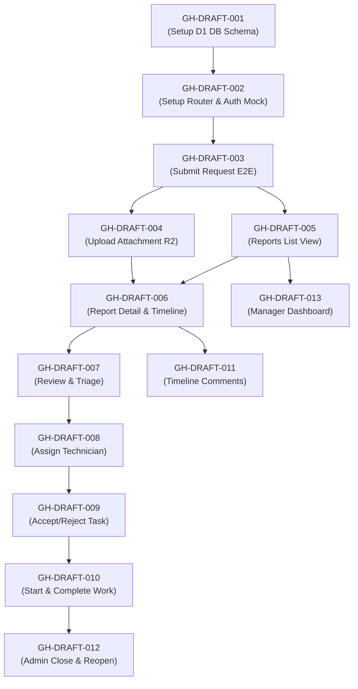

# Campus Service Request and Maintenance System - Issue Plan

## 1. Planning Summary
- **Source Documents**: 
  - [CASE.md](file:///d:/queen/sem8/finance-ai-frontend/campus-maintenance/CASE.md) (Use Case Specification)
  - [output-specification.md](file:///d:/queen/sem8/finance-ai-frontend/campus-maintenance/docs/requirements/output-specification.md) (Software Requirements Specification)
  - [output-architecture-design.md](file:///d:/queen/sem8/finance-ai-frontend/campus-maintenance/docs/design/output-architecture-design.md) (Architecture Design)
  - [output-database-schema.md](file:///d:/queen/sem8/finance-ai-frontend/campus-maintenance/docs/design/output-database-schema.md) (Database Schema)
  - [output-api-contract.md](file:///d:/queen/sem8/finance-ai-frontend/campus-maintenance/docs/design/output-api-contract.md) (API Contract)
- **Scope**: Database schema setup, basic API Worker routing and role-based access guard mock, report creation and validation, image attachment upload, reports listing and details, administrator triage and categorization, technician assignment, technician workflows (accept, reject, progress, complete), comments, administrator close/reopen, and facility manager dashboard.
- **Out of Scope**: External identity provider integration (mock session used), custom notification delivery channels (internal hooks only), advanced inventory, full-text description search, and multi-file attachment upload.
- **Planning Approach**: Vertical slice (combining frontend UI, REST API endpoint, database query, validation, and role-based authorization in each feature issue to deliver functional value).
- **Target Milestone**: MVP (Minimum Viable Product)
- **Assumptions**:
  - *Asumsi*: Sistem autentikasi dan otorisasi menggunakan middleware mock yang membaca identitas pengguna (`actor_id`, `actor_name`, `actor_role`) dari session layer virtual.
  - *Asumsi*: Penolakan tugas oleh teknisi mengembalikan status laporan utama ke `diperiksa` agar Administrator dapat melakukan triase/penugasan kembali.
- **Open Questions**:
  - Apakah konfirmasi penyelesaian oleh Pelapor memerlukan tombol persetujuan eksplisit di UI, ataukah cukup dilakukan melalui penulisan komentar/catatan saja? (Untuk sementara dirancang melalui kombinasi komentar dan aksi penutupan oleh Administrator).

---

## 2. Epic Overview
| Epic ID | Epic Name | Business Value | Related Requirement ID |
|---|---|---|---|
| EPIC-01 | Setup & Core Infrastructure | Mempersiapkan basis data dan routing dasar yang aman untuk pengembangan fitur. | NFR-001, NFR-002, NFR-003 |
| EPIC-02 | Service Request Submission | Pelapor dapat membuat laporan kerusakan fasilitas secara terpusat lengkap dengan bukti foto. | FR-001, FR-002, UC-01 |
| EPIC-03 | Inquiry & Monitoring | Seluruh aktor dapat melihat daftar dan detail laporan sesuai hak akses masing-masing. | FR-003, FR-004, UC-02, UC-03, UC-04 |
| EPIC-04 | Triage & Assignment | Administrator dapat meninjau, menentukan urgensi, dan menunjuk teknisi untuk penanganan masalah. | FR-005, FR-006, FR-007, FR-008, UC-05, UC-06, UC-07 |
| EPIC-05 | Technician Operations | Teknisi dapat merespons tugas, memperbarui progres pengerjaan, dan menyelesaikan tugas. | FR-009, UC-08 |
| EPIC-06 | Collaboration & Audit | Aktor dapat berdiskusi melalui komentar dan sistem secara otomatis mencatat audit trail status. | FR-010, FR-011, UC-09, UC-10 |
| EPIC-07 | Closure & Reporting | Administrator dapat mengelola akhir hidup laporan (tutup/reopen) dan Manajer melihat data agregat. | FR-012, FR-013, UC-11, UC-12 |

---

## 3. Issue Breakdown
| Issue ID | Title | Type | Priority | Blocked By | Requirement ID | Status |
|---|---|---|---|---|---|---|
| GH-DRAFT-001 | Setup Cloudflare D1 database tables and indices | setup | P1 | None | NFR-002, NFR-003 | Draft |
| GH-DRAFT-002 | Setup API routing structure and AuthN/AuthZ mock middleware | setup | P1 | GH-DRAFT-001 | NFR-001, NFR-005 | Draft |
| GH-DRAFT-003 | Submit a new facility service request end-to-end | feature | P1 | GH-DRAFT-002 | FR-001, FR-002, FR-011 | Draft |
| GH-DRAFT-004 | Upload report image attachment to Cloudflare R2 | feature | P2 | GH-DRAFT-003 | FR-001 | Draft |
| GH-DRAFT-005 | View reports list with role-based filtering and search | feature | P1 | GH-DRAFT-003 | FR-003 | Draft |
| GH-DRAFT-006 | View report detail page with timeline and attachments | feature | P1 | GH-DRAFT-004, GH-DRAFT-005 | FR-004, FR-011 | Draft |
| GH-DRAFT-007 | Administrator review and triage service request | feature | P1 | GH-DRAFT-006 | FR-005, FR-006, FR-011 | Draft |
| GH-DRAFT-008 | Administrator assign technician to service request | feature | P1 | GH-DRAFT-007 | FR-007, FR-008, FR-011 | Draft |
| GH-DRAFT-009 | Technician accept or reject task assignment | feature | P1 | GH-DRAFT-008 | FR-009, FR-011 | Draft |
| GH-DRAFT-010 | Technician update status to in-progress and complete | feature | P1 | GH-DRAFT-009 | FR-009, FR-011 | Draft |
| GH-DRAFT-011 | Add comments and notes to service request timeline | feature | P2 | GH-DRAFT-006 | FR-010 | Draft |
| GH-DRAFT-012 | Administrator close or reopen completed service request | feature | P1 | GH-DRAFT-010 | FR-012, FR-011 | Draft |
| GH-DRAFT-013 | Facility Manager view dashboard metrics and statistics | feature | P2 | GH-DRAFT-005 | FR-013 | Draft |

---

## 4. GitHub Issue Drafts

### GH-DRAFT-001: Setup Cloudflare D1 database tables and indices
- **Type**: technical-task
- **Priority**: P1
- **Milestone**: MVP
- **Labels**: setup, backend, database
- **Assignee**: TBD
- **Blocked By**: None
- **Blocks**: GH-DRAFT-002
- **Requirement Traceability**: NFR-002, NFR-003

#### Requirement Terkait
- NFR-002 (Auditability): Sistem merekam perubahan status secara konsisten.
- NFR-003 (Data Integrity): Relasi data tidak boleh terputus.

#### Yang Dibangun
Skema database relasional di Cloudflare D1 dengan 5 tabel utama (`service_requests`, `service_request_comments`, `service_request_status_history`, `service_request_assignments`, `service_request_attachments`) beserta indeks untuk optimalisasi kueri pencarian, filter, dan timeline.

#### Scope
- Membuat file migrasi SQL (`schema.sql`) berisi pembuatan tabel lengkap dengan constraint (FOREIGN KEY, NOT NULL, CHECK constraints untuk `priority` dan `status`).
- Membuat indeks performa untuk pencarian laporan berdasarkan status, prioritas, pembuat, teknisi, komentar, dan histori.
- Mengonfigurasi file `wrangler.jsonc` untuk mengenali binding D1 database.

#### Out of Scope
- Penulisan endpoint API.
- Penyimpanan file fisik (R2).

#### Kriteria Penerimaan
- [ ] Skema database dapat diinisialisasi dan dijalankan sukses pada emulator Cloudflare D1 lokal via Wrangler.
- [ ] Seluruh tabel memiliki foreign key yang merujuk dengan benar ke `service_requests.id`.
- [ ] Nilai kolom status dibatasi pada enum: 'baru', 'diperiksa', 'ditolak', 'ditugaskan', 'diterima', 'sedang_dikerjakan', 'selesai_dikerjakan', 'ditutup', 'dibuka_kembali'.
- [ ] Nilai kolom prioritas dibatasi pada enum: 'low', 'medium', 'high', 'urgent'.

#### Test Notes
- Jalankan `wrangler d1 migrations apply` dan periksa keutuhan skema menggunakan kueri SQL `PRAGMA table_info`.

#### Diblokir Oleh
- Tidak ada.

---

### GH-DRAFT-002: Setup API routing structure and AuthN/AuthZ mock middleware
- **Type**: technical-task
- **Priority**: P1
- **Milestone**: MVP
- **Labels**: setup, backend, security
- **Assignee**: TBD
- **Blocked By**: GH-DRAFT-001
- **Blocks**: GH-DRAFT-003
- **Requirement Traceability**: NFR-001, NFR-005, NFR-006

#### Requirement Terkait
- NFR-001 (Security): Pembatasan akses fitur sensitif berdasarkan peran pengguna.
- NFR-005 (Availability): Penanganan error yang graceful dan aman.
- NFR-006 (Observability): Logging terstruktur.

#### Yang Dibangun
Infrastruktur routing Cloudflare Worker API, penanganan error terpusat, dan middleware autentikasi/otorisasi tiruan (mock) yang mengekstrak informasi aktor (`actor_id`, `actor_name`, `actor_role`) dari header permintaan untuk memfasilitasi pengujian peran.

#### Scope
- Inisialisasi router di Cloudflare Worker (misal menggunakan TypeScript).
- Implementasi middleware global error handler untuk menangkap exception dan mengembalikan format JSON error standar (`UNAUTHORIZED`, `FORBIDDEN`, `VALIDATION_ERROR`, dll.).
- Implementasi middleware Auth Guard yang memvalidasi keberadaan profil pengguna tiruan dan menetapkan hak akses peran (`Pelapor`, `Administrator`, `Teknisi`, `Manajer Fasilitas`).

#### Out of Scope
- Integrasi penyedia identitas riil (OAuth/OIDC).
- Antarmuka web.

#### Kriteria Penerimaan
- [ ] Request tanpa header identitas mock yang valid menghasilkan response `401 Unauthorized`.
- [ ] Request yang melanggar batasan peran menghasilkan response `403 Forbidden`.
- [ ] Runtime error di API tidak membocorkan stack trace dan mengembalikan response terstruktur dengan status HTTP yang sesuai (mis. 500 / 503).

#### Test Notes
- Tulis unit/integration test untuk memverifikasi middleware routing terhadap request tanpa auth and request dengan role tidak sesuai.

#### Diblokir Oleh
- GH-DRAFT-001 (Setup database migrasi dibutuhkan untuk memastikan koneksi Worker-D1 siap).

---

### GH-DRAFT-003: Submit a new facility service request end-to-end
- **Type**: feature
- **Priority**: P1
- **Milestone**: MVP
- **Labels**: feature, vertical-slice, service-request
- **Assignee**: TBD
- **Blocked By**: GH-DRAFT-002
- **Blocks**: GH-DRAFT-004, GH-DRAFT-005
- **Requirement Traceability**: FR-001, FR-002, FR-011, BR-001, BR-006, UC-01

#### Requirement Terkait
- FR-001: Pelapor dapat membuat laporan baru.
- FR-002: Sistem menolak pembuatan laporan jika lokasi, jenis masalah, atau deskripsi kosong.
- FR-011 / BR-006: Sistem otomatis menyimpan riwayat status laporan.
- BR-001: Data minimum laporan adalah lokasi, jenis masalah, deskripsi.

#### Yang Dibangun
Fitur pembuatan laporan kerusakan fasilitas kampus. Pelapor dapat mengisi form di UI web, data dikirim ke backend API, divalidasi, disimpan ke tabel D1 `service_requests` dengan status awal "Baru", dan histori awal dicatat di `service_request_status_history`.

#### Scope
- **Frontend UI**: Halaman form "Buat Laporan Baru" berisi input: Lokasi, Jenis Masalah, Deskripsi, serta tombol Kirim. Menangani state loading, success, dan validation error.
- **REST API**: Endpoint `POST /api/reports` yang memvalidasi kelengkapan payload input dan hak akses peran (`Pelapor`).
- **Database**: Insert data baru ke `service_requests` dengan status 'baru' dan insert ke `service_request_status_history` (old_status = null, new_status = 'baru').

#### Out of Scope
- Unggah foto lampiran (akan ditangani di GH-DRAFT-004).
- Penentuan prioritas atau kategori.

#### Kriteria Penerimaan
- [ ] *Given* Pelapor telah login, *when* mengirim form dengan lokasi, jenis masalah, dan deskripsi valid, *then* laporan baru tersimpan dengan status 'baru', riwayat status pertama dicatat, dan muncul pesan sukses.
- [ ] *Given* salah satu field wajib kosong (lokasi, jenis masalah, atau deskripsi), *when* mengirim form, *then* sistem menampilkan pesan validasi error dan request tidak disimpan di database.
- [ ] *Given* pengguna dengan peran Administrator atau Teknisi, *when* menembak endpoint `POST /api/reports`, *then* sistem mengembalikan `403 Forbidden`.

#### Test Notes
- Lakukan integration test pada API `POST /api/reports` dengan payload valid dan tidak valid.
- Verifikasi bahwa record terbuat di tabel `service_requests` dan `service_request_status_history` dengan ID relasi yang cocok.

#### Diblokir Oleh
- GH-DRAFT-002 (Memerlukan routing dan auth guard middleware).

---

### GH-DRAFT-004: Upload report image attachment to Cloudflare R2
- **Type**: feature
- **Priority**: P2
- **Milestone**: MVP
- **Labels**: feature, vertical-slice, service-request
- **Assignee**: TBD
- **Blocked By**: GH-DRAFT-003
- **Blocks**: GH-DRAFT-006
- **Requirement Traceability**: FR-001, UC-01

#### Requirement Terkait
- FR-001: Pelapor dapat mengunggah lampiran foto opsional saat membuat laporan.

#### Yang Dibangun
Fitur pengunggahan bukti foto kerusakan fasilitas. Foto dikirim melalui API, disimpan ke Cloudflare R2 bucket, dan metadata file (nama file, tipe mime, key objek R2, ukuran) dicatat ke database D1 `service_request_attachments` yang berelasi ke laporan terkait.

#### Scope
- **Frontend UI**: Komponen file picker gambar pada form laporan baru dengan validasi ukuran file dan tipe ekstensi sebelum dikirim.
- **REST API**: Endpoint `POST /api/reports/:reportId/attachments` menerima data `multipart/form-data` gambar, memproses unggah ke Cloudflare R2, dan menyimpan referensinya ke database.
- **Wrangler**: Konfigurasi binding R2 bucket di `wrangler.jsonc`.

#### Out of Scope
- Pengunggahan beberapa file sekaligus (dibatasi 1 file gambar per laporan).
- Penghapusan gambar dari R2.

#### Kriteria Penerimaan
- [ ] *Given* Pelapor adalah pemilik laporan, *when* mengunggah file gambar (JPEG/PNG) kurang dari batas maksimal (mis. 5MB), *then* file berhasil tersimpan di R2, metadata tersimpan di tabel `service_request_attachments`, dan sistem mengembalikan response sukses `201 Created`.
- [ ] *Given* file yang diunggah bukan gambar atau melebihi batas ukuran, *when* mengunggah, *then* sistem mengembalikan `400 Bad Request` dengan pesan error validasi.
- [ ] *Given* pengguna mencoba mengunggah foto ke laporan yang bukan miliknya, *when* mengunggah, *then* sistem mengembalikan `403 Forbidden`.

#### Test Notes
- Gunakan integration test mock-file upload untuk menguji transfer file ke R2 lokal (via Wrangler dev R2 storage).
- Periksa kesesuaian foreign key di tabel `service_request_attachments` terhadap `service_requests.id`.

#### Diblokir Oleh
- GH-DRAFT-003 (Memerlukan objek laporan yang valid untuk menempelkan lampiran).

---

### GH-DRAFT-005: View reports list with role-based filtering and search
- **Type**: feature
- **Priority**: P1
- **Milestone**: MVP
- **Labels**: feature, vertical-slice, service-request
- **Assignee**: TBD
- **Blocked By**: GH-DRAFT-003
- **Blocks**: GH-DRAFT-006, GH-DRAFT-013
- **Requirement Traceability**: FR-003, BR-002, BR-003, BR-004, UC-02, UC-03

#### Requirement Terkait
- FR-003: Menampilkan daftar laporan sesuai peran pengguna.
- BR-002: Pelapor hanya dapat melihat daftar laporan miliknya.
- BR-003: Administrator dapat melihat seluruh laporan.
- BR-004: Teknisi hanya dapat melihat laporan yang ditugaskan kepadanya.

#### Yang Dibangun
Halaman daftar laporan yang membatasi data yang tampil berdasarkan peran aktor yang sedang masuk. Pengguna dapat mencari laporan berdasarkan kata kunci teks, menyaring berdasarkan status/prioritas/kategori, dan melihat pagination hasil.

#### Scope
- **Frontend UI**: Halaman daftar laporan yang menampilkan kartu/tabel berisi status singkat laporan (ID, lokasi, jenis masalah, prioritas, kategori, tanggal dibuat). Menyediakan input pencarian teks dan filter dropdown.
- **REST API**: Endpoint `GET /api/reports` mendukung parameter kueri (`status`, `priority`, `category`, `page`, `page_size`, `sort`). Endpoint menyaring baris otomatis berdasarkan peran pengguna dari mock session.

#### Out of Scope
- Navigasi ke halaman detail laporan (hanya navigasi daftar).

#### Kriteria Penerimaan
- [ ] *Given* Pelapor masuk ke halaman daftar, *when* memuat data, *then* hanya laporan yang dibuat oleh pelapor tersebut (`reporter_id == actor_id`) yang dikembalikan.
- [ ] *Given* Administrator masuk ke halaman daftar, *when* memuat data, *then* seluruh laporan di sistem ditampilkan tanpa pembatasan pelapor.
- [ ] *Given* Teknisi masuk ke halaman daftar, *when* memuat data, *then* hanya laporan dengan `assigned_technician_id == actor_id` yang ditampilkan.
- [ ] *Given* filter status 'baru' diaktifkan oleh Administrator, *when* memuat data, *then* sistem mengembalikan laporan yang berstatus 'baru' diurutkan berdasarkan tanggal terbaru.

#### Test Notes
- Tulis pengujian fungsional database untuk memverifikasi query clause `WHERE` terpasang dengan benar untuk setiap peran pengguna.

#### Diblokir Oleh
- GH-DRAFT-003 (Membutuhkan data laporan untuk ditampilkan).

---

### GH-DRAFT-006: View report detail page with timeline and attachments
- **Type**: feature
- **Priority**: P1
- **Milestone**: MVP
- **Labels**: feature, vertical-slice, service-request
- **Assignee**: TBD
- **Blocked By**: GH-DRAFT-004, GH-DRAFT-005
- **Blocks**: GH-DRAFT-007, GH-DRAFT-011
- **Requirement Traceability**: FR-004, FR-011, UC-04, UC-10

#### Requirement Terkait
- FR-004: Menampilkan detail laporan lengkap beserta komentar dan riwayat status.
- FR-011: Riwayat status otomatis tercatat dan dapat ditampilkan.

#### Yang Dibangun
Halaman detail laporan komprehensif. Menampilkan rincian deskripsi masalah, metadata lampiran foto, render gambar yang bersumber dari Cloudflare R2, linimasa (timeline) perubahan status secara kronologis, dan percakapan komentar.

#### Scope
- **Frontend UI**: Halaman detail laporan terstruktur. Menyajikan detail utama, galeri lampiran foto, linimasa alur status (tanggal, aktor, status perubahan), dan area diskusi komentar.
- **REST API**: Endpoint `GET /api/reports/:reportId` melakukan query relasional `LEFT JOIN` atau kueri terpisah yang aman ke tabel `service_requests`, `service_request_comments`, `service_request_status_history`, dan `service_request_attachments`. Memastikan otorisasi peran terpenuhi sebelum data dikembalikan.

#### Out of Scope
- Aksi perubahan status seperti triase atau penugasan (hanya visualisasi detail).
- Formulir pengiriman komentar baru.

#### Kriteria Penerimaan
- [ ] *Given* pengguna berwenang membuka laporan, *when* detail dimuat, *then* sistem menampilkan deskripsi lengkap, nama pelapor, gambar lampiran, kronologi histori status dari awal sampai status aktif, dan daftar komentar.
- [ ] *Given* Pelapor mencoba membuka detail laporan milik orang lain, *when* diakses, *then* sistem menolak dan mengembalikan response `403 Forbidden`.
- [ ] *Given* ID laporan tidak terdaftar di sistem, *when* diakses, *then* sistem mengembalikan `404 Not Found`.

#### Test Notes
- Verifikasi response JSON dari endpoint detail berisi array objek `status_history` dan `attachments` yang lengkap dan terstruktur.

#### Diblokir Oleh
- GH-DRAFT-004 (Memerlukan integrasi data lampiran).
- GH-DRAFT-005 (Memerlukan daftar laporan untuk navigasi detail).

---

### GH-DRAFT-007: Administrator review and triage service request
- **Type**: feature
- **Priority**: P1
- **Milestone**: MVP
- **Labels**: feature, vertical-slice, triage
- **Assignee**: TBD
- **Blocked By**: GH-DRAFT-006
- **Blocks**: GH-DRAFT-008
- **Requirement Traceability**: FR-005, FR-006, FR-011, BR-005, BR-006, UC-05, UC-06

#### Requirement Terkait
- FR-005: Administrator dapat memeriksa laporan dan menetapkan kategori.
- FR-006: Administrator dapat menentukan prioritas laporan.
- BR-005: Prioritas harus dipilih dari nilai yang disetujui ('low', 'medium', 'high', 'urgent').
- UC-05 A1: Administrator dapat menolak laporan dengan status akhir "Ditolak" dan mencatat alasan.

#### Yang Dibangun
Alur pemeriksaan (triase) oleh Administrator. Di halaman detail laporan, Administrator dapat menyetujui laporan dengan menetapkan Kategori (mis. Kelistrikan, Sipil, dll.) dan Prioritas, atau menolaknya dengan mengisi Alasan Penolakan. Status laporan berubah secara dinamis di database.

#### Scope
- **Frontend UI**: Kontrol triase pada detail laporan khusus Administrator: dropdown Kategori, dropdown Prioritas, tombol "Simpan Triase", dan tombol "Tolak Laporan" dengan input teks alasan.
- **REST API**: Endpoint `PATCH /api/reports/:reportId/triage` memvalidasi payload, memastikan aktor adalah `Administrator`, status laporan saat ini adalah `baru`.
- **Database**: Memperbarui kolom `category`, `priority`, `status` ('diperiksa' atau 'ditolak'), dan `rejection_reason` jika ditolak. Menyimpan histori ke `service_request_status_history`.

#### Out of Scope
- Penunjukan teknisi (GH-DRAFT-008).

#### Kriteria Penerimaan
- [ ] *Given* Administrator membuka laporan berstatus 'baru', *when* mengisi kategori, prioritas 'high', dan menyimpan, *then* status laporan berubah menjadi 'diperiksa', prioritas tersimpan, dan riwayat status terekam.
- [ ] *Given* Administrator menolak laporan dengan alasan "Duplikat", *when* menyimpan, *then* status laporan berubah menjadi 'ditolak', kolom `rejection_reason` terisi, dan alur pelaporan berhenti.
- [ ] *Given* laporan sudah berstatus 'diperiksa', *when* Administrator mencoba menembak API triage kembali, *then* sistem menolak dengan response `409 Conflict`.

#### Test Notes
- Uji transisi status tidak valid (misalnya dari 'ditugaskan' kembali ke 'triage') dan pastikan di-reject oleh API layer.

#### Diblokir Oleh
- GH-DRAFT-006 (Memerlukan basis visualisasi halaman detail).

---

### GH-DRAFT-008: Administrator assign technician to service request
- **Type**: feature
- **Priority**: P1
- **Milestone**: MVP
- **Labels**: feature, vertical-slice, assignment
- **Assignee**: TBD
- **Blocked By**: GH-DRAFT-007
- **Blocks**: GH-DRAFT-009
- **Requirement Traceability**: FR-007, FR-008, FR-011, BR-006, UC-07

#### Requirement Terkait
- FR-007: Administrator dapat menugaskan teknisi ke laporan.
- FR-008: Status laporan berubah menjadi "Ditugaskan" setelah penugasan disimpan.

#### Yang Dibangun
Alur penugasan teknisi. Administrator memilih salah satu teknisi terdaftar untuk menyelesaikan laporan yang berstatus "Diperiksa" atau "Dibuka Kembali". Penugasan disimpan ke tabel penugasan aktif, status laporan berubah menjadi "Ditugaskan", dan notifikasi internal dipicu.

#### Scope
- **Frontend UI**: Modal/dropdown penugasan yang memuat daftar Teknisi pada halaman detail Administrator. Tombol "Tugaskan Teknisi".
- **REST API**: Endpoint `POST /api/reports/:reportId/assign` menerima payload `technician_id`, memvalidasi peran Administrator, dan memastikan status laporan aktif adalah `diperiksa` atau `dibuka_kembali`.
- **Database**: 
  - Update `service_requests.status` menjadi 'ditugaskan' dan `assigned_technician_id`.
  - Nonaktifkan assignment lama jika ada penugasan ulang (`is_active = 0`).
  - Insert record baru ke `service_request_assignments` dengan status aktif (`is_active = 1`).
  - Insert status history ke `service_request_status_history`.

#### Out of Scope
- Logika menghitung beban kerja teknisi secara dinamis (hanya dropdown statis teknisi).

#### Kriteria Penerimaan
- [ ] *Given* Administrator memilih teknisi "Budi" untuk laporan berstatus 'diperiksa', *when* menyimpan penugasan, *then* status laporan berubah menjadi 'ditugaskan', entri penugasan aktif dibuat di `service_request_assignments`, dan status history dicatat.
- [ ] *Given* laporan berstatus 'baru' (belum melalui triase), *when* mencoba menugaskan teknisi, *then* sistem mengembalikan `409 Conflict` karena harus ditriase terlebih dahulu.

#### Test Notes
- Verifikasi bahwa ketika penugasan di-update ke teknisi baru, entri penugasan lama diset menjadi tidak aktif (`is_active = 0`) dan entri baru dibuat aktif (`is_active = 1`).

#### Diblokir Oleh
- GH-DRAFT-007 (Laporan harus ditriase/diperiksa sebelum ditugaskan).

---

### GH-DRAFT-009: Technician accept or reject task assignment
- **Type**: feature
- **Priority**: P1
- **Milestone**: MVP
- **Labels**: feature, vertical-slice, assignment
- **Assignee**: TBD
- **Blocked By**: GH-DRAFT-008
- **Blocks**: GH-DRAFT-010
- **Requirement Traceability**: FR-009, FR-011, BR-006, UC-08

#### Requirement Terkait
- FR-009: Teknisi dapat menerima tugas atau menolak tugas dengan alasan.
- UC-08 A1: Jika tugas ditolak teknisi, status laporan kembali menjadi "Diperiksa" agar dapat ditugaskan ulang.

#### Yang Dibangun
Alur persetujuan tugas oleh Teknisi. Ketika Teknisi membuka laporan yang ditugaskan kepadanya, mereka dapat menekan "Terima Tugas" (status berubah menjadi "Diterima") atau "Tolak Tugas" dengan menuliskan alasan penolakan (tugas dinonaktifkan, status laporan kembali ke "Diperiksa" agar Admin dapat menugaskan kembali).

#### Scope
- **Frontend UI**: Tombol tindakan "Terima Tugas" dan "Tolak Tugas" pada halaman detail Teknisi. Menyediakan dialog popup input teks alasan penolakan jika tombol tolak ditekan.
- **REST API**: 
  - Endpoint `POST /api/reports/:reportId/assignment/accept` (status -> `diterima`).
  - Endpoint `POST /api/reports/:reportId/assignment/reject` (alasan disimpan, assignment dinonaktifkan, status laporan -> `diperiksa`).
- **Database**: Pembaruan kolom status laporan, pencatatan waktu penerimaan (`acknowledged_at`) atau penolakan (`rejected_at`, `rejection_reason`) pada tabel penugasan, dan penulisan ke riwayat status.

#### Out of Scope
- Auto-routing penugasan ulang otomatis oleh AI (penugasan ulang dilakukan manual oleh Admin).

#### Kriteria Penerimaan
- [ ] *Given* Teknisi ditugaskan ke laporan, *when* menekan "Terima Tugas", *then* status berubah menjadi 'diterima' dan tercatat waktu acknowledge.
- [ ] *Given* Teknisi menekan "Tolak Tugas" dengan alasan "Lokasi terlalu jauh", *when* dikirim, *then* assignment aktif dinonaktifkan (`is_active = 0`), alasan dicatat, status laporan utama kembali menjadi 'diperiksa', dan riwayat status tercatat.
- [ ] *Given* Teknisi lain yang tidak ditugaskan mencoba mengakses endpoint accept/reject, *when* dikirim, *then* sistem mengembalikan `403 Forbidden`.

#### Test Notes
- Uji alur penolakan tugas dan pastikan Administrator dapat melihat kembali laporan tersebut pada daftar triase untuk ditugaskan ulang.

#### Diblokir Oleh
- GH-DRAFT-008 (Membutuhkan laporan yang sudah berstatus 'ditugaskan').

---

### GH-DRAFT-010: Technician update status to in-progress and complete
- **Type**: feature
- **Priority**: P1
- **Milestone**: MVP
- **Labels**: feature, vertical-slice, progress
- **Assignee**: TBD
- **Blocked By**: GH-DRAFT-009
- **Blocks**: GH-DRAFT-012
- **Requirement Traceability**: FR-009, FR-011, BR-006, UC-08

#### Requirement Terkait
- FR-009: Teknisi memperbarui progres pekerjaan dan menandai pekerjaan selesai.

#### Yang Dibangun
Alur pengerjaan tugas oleh Teknisi. Setelah menerima tugas, Teknisi dapat memperbarui status pengerjaan menjadi "Sedang Dikerjakan" saat mulai memperbaiki kerusakan di lapangan, dan kemudian menandainya sebagai "Selesai Dikerjakan" setelah perbaikan rampung.

#### Scope
- **Frontend UI**: Tombol pemicu "Mulai Pekerjaan" (aktif pada status `diterima`) dan tombol "Tandai Selesai" (aktif pada status `sedang_dikerjakan`) dengan opsional pengisian catatan singkat di detail laporan Teknisi.
- **REST API**:
  - Endpoint `POST /api/reports/:reportId/progress/start` (status -> `sedang_dikerjakan`).
  - Endpoint `POST /api/reports/:reportId/progress/complete` (status -> `selesai_dikerjakan`).
- **Database**: Mengubah status laporan di `service_requests`, mengisi kolom `started_at` dan `completed_at`, serta menambahkan histori perubahan status di `service_request_status_history`.

#### Out of Scope
- Unggah foto bukti hasil kerja (hanya pengisian catatan kemajuan).

#### Kriteria Penerimaan
- [ ] *Given* status laporan adalah 'diterima', *when* Teknisi menekan "Mulai Pekerjaan", *then* status laporan berubah menjadi 'sedang_dikerjakan', kolom `started_at` terisi UTC timestamp, dan riwayat status dicatat.
- [ ] *Given* status laporan adalah 'sedang_dikerjakan', *when* Teknisi menekan "Tandai Selesai", *then* status laporan berubah menjadi 'selesai_dikerjakan', kolom `completed_at` terisi UTC timestamp, dan riwayat status dicatat.

#### Test Notes
- Pastikan transisi status terkunci secara ketat dan berurutan: Diterima -> Sedang Dikerjakan -> Selesai Dikerjakan.

#### Diblokir Oleh
- GH-DRAFT-009 (Tugas harus diterima terlebih dahulu sebelum bisa mulai dikerjakan).

---

### GH-DRAFT-011: Add comments and notes to service request timeline
- **Type**: feature
- **Priority**: P2
- **Milestone**: MVP
- **Labels**: feature, vertical-slice, comment
- **Assignee**: TBD
- **Blocked By**: GH-DRAFT-006
- **Blocks**: None
- **Requirement Traceability**: FR-010, UC-09

#### Requirement Terkait
- FR-010: Sistem memungkinkan komentar atau catatan pada laporan dari aktor yang berwenang.
- UC-09: Komentar tersimpan dan ditampilkan pada detail laporan beserta waktu dan nama pengirim.

#### Yang Dibangun
Fitur kolaborasi chat/komentar pada laporan. Pelapor, Administrator, dan Teknisi dapat menambahkan catatan kemajuan, menanyakan detail lokasi, atau memberikan umpan balik perbaikan langsung pada halaman detail laporan.

#### Scope
- **Frontend UI**: Formulir input teks komentar di bawah timeline detail laporan dengan tombol kirim. Memperbarui daftar percakapan setelah komentar berhasil dikirim.
- **REST API**: Endpoint `POST /api/reports/:reportId/comments` yang memproses payload `body` komentar, memvalidasi hak akses aktor terhadap laporan, dan melakukan insert ke database.
- **Database**: Menyimpan baris baru di tabel `service_request_comments` dengan merekam snapshot penulis (`author_id`, `author_name`, `author_role`).

#### Out of Scope
- Menghapus (*delete*) atau menyunting (*edit*) komentar yang sudah dikirim.
- Mentransfer file media di dalam komentar.

#### Kriteria Penerimaan
- [ ] *Given* aktor memiliki akses ke laporan, *when* mengirim teks komentar non-kosong, *then* komentar berhasil disimpan di database, muncul di timeline kronologis, dan tertera nama serta waktu pengiriman secara benar.
- [ ] *Given* input komentar kosong, *when* dikirim, *then* API menolak dengan status `400 Bad Request`.

#### Test Notes
- Uji otorisasi agar pengguna luar yang tidak berhak tidak dapat menyisipkan komentar ke laporan melalui API.

#### Diblokir Oleh
- GH-DRAFT-006 (Membutuhkan container timeline komentar di halaman detail).

---

### GH-DRAFT-012: Administrator close or reopen completed service request
- **Type**: feature
- **Priority**: P1
- **Milestone**: MVP (Pending Validation)
- **Labels**: feature, vertical-slice, closure
- **Assignee**: TBD
- **Blocked By**: GH-DRAFT-010
- **Blocks**: None
- **Requirement Traceability**: FR-012, BR-007, BR-008, UC-11

#### Requirement Terkait
- FR-012: Administrator dapat menutup laporan atau membuka kembali laporan yang belum sesuai.
- BR-007: Laporan hanya boleh ditutup setelah pekerjaan dikonfirmasi pelapor.
- BR-008: Laporan dibuka kembali mengembalikannya ke alur penugasan.

#### Yang Dibangun
Alur penutupan atau pengerjaan ulang laporan oleh Administrator. Setelah Teknisi menyelesaikan tugas (status "Selesai Dikerjakan"), Administrator berkoordinasi dengan Pelapor. Jika hasil kerja sudah oke, Administrator menutup laporan (status "Ditutup"). Jika belum oke, Administrator membukanya kembali (status "Dibuka Kembali" dan ditugaskan ulang).

#### Scope
- **Frontend UI**: Tombol aksi "Tutup Laporan" (dengan modal catatan penutupan) dan tombol "Buka Kembali" (dengan input alasan pengerjaan ulang) pada detail laporan Administrator.
- **REST API**:
  - Endpoint `POST /api/reports/:reportId/close` (status -> `ditutup`).
  - Endpoint `POST /api/reports/:reportId/reopen` (status -> `dibuka_kembali`).
- **Database**: Memperbarui status laporan di `service_requests`, mencatat waktu penutupan (`closed_at`) atau pengerjaan ulang (`reopened_at`), dan menambah histori perubahan status.

#### Out of Scope
- Validasi sistem otomatis untuk konfirmasi pelapor (sementara diasumsikan Administrator memvalidasi secara manual melalui komentar/telepon sebelum menekan tombol tutup).

#### Kriteria Penerimaan
- [ ] *Given* status laporan adalah 'selesai_dikerjakan', *when* Administrator menekan "Tutup Laporan", *then* status laporan menjadi 'ditutup', tercatat waktu closing, dan alur selesai.
- [ ] *Given* status laporan adalah 'selesai_dikerjakan', *when* Administrator menekan "Buka Kembali" dengan alasan "Cat dinding masih terkelupas", *then* status laporan berubah menjadi 'dibuka_kembali', alur kembali ke triase/penugasan, dan riwayat status tercatat.

#### Test Notes
- Pastikan laporan yang sudah berstatus 'ditutup' tidak dapat diubah statusnya lagi oleh peran apa pun.

#### Diblokir Oleh
- GH-DRAFT-010 (Pekerjaan harus diselesaikan oleh teknisi sebelum dapat ditutup/di-reopen).

---

### GH-DRAFT-013: Facility Manager view dashboard metrics and statistics
- **Type**: feature
- **Priority**: P2
- **Milestone**: MVP (Pending Validation)
- **Labels**: feature, vertical-slice, dashboard
- **Assignee**: TBD
- **Blocked By**: GH-DRAFT-005
- **Blocks**: None
- **Requirement Traceability**: FR-013, UC-12

#### Requirement Terkait
- FR-013: Dashboard ringkas menampilkan jumlah laporan per status, kategori, prioritas, dan rata-rata waktu penyelesaian.

#### Yang Dibangun
Halaman Dashboard statistik untuk Manajer Fasilitas. Data dihitung secara agregat di sisi backend API menggunakan kueri D1, dikirim dalam format JSON ringkas, dan ditampilkan menggunakan kartu visual/grafik sederhana di UI frontend.

#### Scope
- **Frontend UI**: Halaman Dashboard khusus dengan widgets/cards menampilkan jumlah laporan aktif, persentase laporan selesai, rata-rata waktu respons penanganan (dalam jam), serta breakdown jumlah per kategori dan prioritas.
- **REST API**: Endpoint `GET /api/dashboard` yang melakukan query agregat (`COUNT`, `AVG` selisih timestamp `completed_at` dengan `created_at`) dari D1.
- **Security**: Membatasi endpoint hanya dapat diakses oleh peran `Manajer Fasilitas` atau `Administrator`.

#### Out of Scope
- Filter rentang waktu kustom yang kompleks (di-hardcode ke rentang waktu default untuk MVP).
- Fitur ekspor laporan ke format PDF atau Excel.

#### Kriteria Penerimaan
- [ ] *Given* Manajer Fasilitas membuka menu Dashboard, *when* halaman dimuat, *then* data statistik real-time (jumlah per status, prioritas, kategori, dan rata-rata durasi penyelesaian) terisi dengan benar.
- [ ] *Given* Pelapor atau Teknisi mencoba menembak API dashboard, *when* diakses, *then* sistem mengembalikan `403 Forbidden`.

#### Test Notes
- Tulis pengujian kueri SQL agregat untuk memastikan perhitungan rata-rata waktu penyelesaian (selisih completed dan created) menghasilkan nilai yang presisi.

#### Diblokir Oleh
- GH-DRAFT-005 (Memerlukan data sebaran laporan yang tersebar di database untuk menghasilkan agregat).

---

## 5. Dependency Order
Proses implementasi direncanakan mengalir secara berurutan sesuai bagan alur ketergantungan berikut:

1. **Infrastruktur Dasar**: Setup database (`GH-DRAFT-001`) diselesaikan pertama kali, diikuti oleh setup API router dasar dan mock auth guard (`GH-DRAFT-002`).
2. **Alur Pelaporan Awal**: Pelapor membuat laporan (`GH-DRAFT-003`), lampiran gambar dikonfigurasi (`GH-DRAFT-004`), daftar laporan dapat dilihat (`GH-DRAFT-005`), dan detail laporan dimuat (`GH-DRAFT-006`).
3. **Alur Triase & Penugasan**: Laporan ditinjau oleh Admin (`GH-DRAFT-007`) lalu ditugaskan ke Teknisi (`GH-DRAFT-008`).
4. **Alur Penanganan Teknisi**: Teknisi merespons tugas (`GH-DRAFT-009`), mengerjakan dan merampungkan tugas (`GH-DRAFT-010`).
5. **Alur Akhir & Analitik**: Laporan ditutup/dibuka kembali (`GH-DRAFT-012`), komentar diaktifkan (`GH-DRAFT-011`), dan dashboard untuk Manajer diselesaikan (`GH-DRAFT-013`).

---

## 6. Requirement Traceability Matrix
Matriks di bawah ini menunjukkan cakupan penelusuran dari dokumen SRS (`output-specification.md`) ke rancangan issue:

| Requirement ID | Requirement Summary | Covered by Issue | Covered? | Notes |
|---|---|---|---|---|
| **FR-001** | Pembuatan laporan dengan deskripsi, lokasi, jenis, foto | GH-DRAFT-003, GH-DRAFT-004 | Yes | Tercover E2E lewat form submit & upload R2 |
| **FR-002** | Validasi kolom wajib pembuatan laporan | GH-DRAFT-003 | Yes | Divalidasi di UI dan API backend |
| **FR-003** | Tampilan daftar laporan sesuai peran | GH-DRAFT-005 | Yes | Query database otomatis menyaring sesuai role |
| **FR-004** | Tampilan detail laporan lengkap | GH-DRAFT-006 | Yes | Memuat detail, riwayat status, comments, attachments |
| **FR-005** | Administrator memeriksa & memberi kategori | GH-DRAFT-007 | Yes | Status transisi ke 'diperiksa' atau 'ditolak' |
| **FR-006** | Administrator menentukan prioritas | GH-DRAFT-007 | Yes | Dropdown prioritas tervalidasi enum |
| **FR-007** | Administrator menugaskan teknisi | GH-DRAFT-008 | Yes | Pembuatan entri di tabel assignment |
| **FR-008** | Status otomatis berubah menjadi "Ditugaskan" | GH-DRAFT-008 | Yes | Update status request & logging status history |
| **FR-009** | Alur respon, progres, dan penyelesaian teknisi | GH-DRAFT-009, GH-DRAFT-010 | Yes | Accept, reject (re-triage), start, complete status |
| **FR-010** | Penulisan komentar pada laporan | GH-DRAFT-011 | Yes | Penulisan catatan append-only ke database |
| **FR-011** | Riwayat status otomatis | GH-DRAFT-003, GH-DRAFT-007, GH-DRAFT-008, GH-DRAFT-009, GH-DRAFT-010, GH-DRAFT-012 | Yes | Setiap event transisi status menulis ke `service_request_status_history` |
| **FR-012** | Administrator menutup atau membuka kembali laporan | GH-DRAFT-012 | Yes | Status transisi ke 'ditutup' atau 'dibuka_kembali' |
| **FR-013** | Dashboard bagi Manajer Fasilitas | GH-DRAFT-013 | Yes | Kueri agregat statistik D1 |
| **NFR-001** | Otorisasi hak akses peran | GH-DRAFT-002 | Yes | Middleware Auth guard membatasi role per endpoint |
| **NFR-002** | Rekam perubahan status secara audit | GH-DRAFT-001, GH-DRAFT-003, GH-DRAFT-007, GH-DRAFT-008, GH-DRAFT-009, GH-DRAFT-010, GH-DRAFT-012 | Yes | Skema status history mencatat aktor, waktu, old/new status |
| **NFR-003** | Integritas referensi relasi database | GH-DRAFT-001 | Yes | Constraint foreign key Cascade/Restrict pada skema D1 |
| **NFR-004** | Konsistensi label status | GH-DRAFT-001, GH-DRAFT-003, GH-DRAFT-005, GH-DRAFT-006, GH-DRAFT-013 | Yes | Glosarium status disamakan dari database ke UI |
| **NFR-005** | Penanganan error aman & availability | GH-DRAFT-002 | Yes | Centralized error catcher mengaburkan internal storage |

---

## 7. Publish Checklist
- [x] Draft issue sudah direview secara logis dan terurut.
- [x] Ketergantungan antar issue (dependency) didefinisikan dengan jelas dan tidak melingkar.
- [x] Seluruh kriteria penerimaan (acceptance criteria) dapat diuji menggunakan perilaku objektif.
- [x] Traceability dari Requirement ID (FR/NFR) terpenuhi sepenuhnya.
- [ ] Pengguna memberikan persetujuan final untuk melakukan publikasi ke repository GitHub (Menunggu konfirmasi).

---

## 8. Quality Check Result
- **Complete**: Yes. Seluruh modul fungsional (FR-001 hingga FR-013) serta kebutuhan non-fungsional arsitektur dan database schema telah dialokasikan ke dalam minimal satu issue draft.
- **Independent**: Yes. Setiap issue memiliki batasan scope dan out-of-scope yang tegas.
- **Vertical**: Yes. Seluruh issue berlabel `feature` dirancang dengan menyertakan pekerjaan layer UI frontend, API routing, database query, dan authorization check secara bersamaan agar menghasilkan produk akhir yang langsung dapat didemonstrasikan.
- **Traceable**: Yes. Setiap issue merujuk ke Requirement ID, Use Case ID, dan aturan bisnis yang bersangkutan.
- **Testable**: Yes. Setiap kriteria penerimaan ditulis menggunakan skenario teruji yang objektif (Given-When-Then).
- **Dependency Clear**: Yes. Urutan rilis dan blokir antar issue telah digambarkan dalam bagan mermaid dan terdefinisi di setiap rincian issue.
- **Ready to Publish**: No (menunggu persetujuan manusia).
