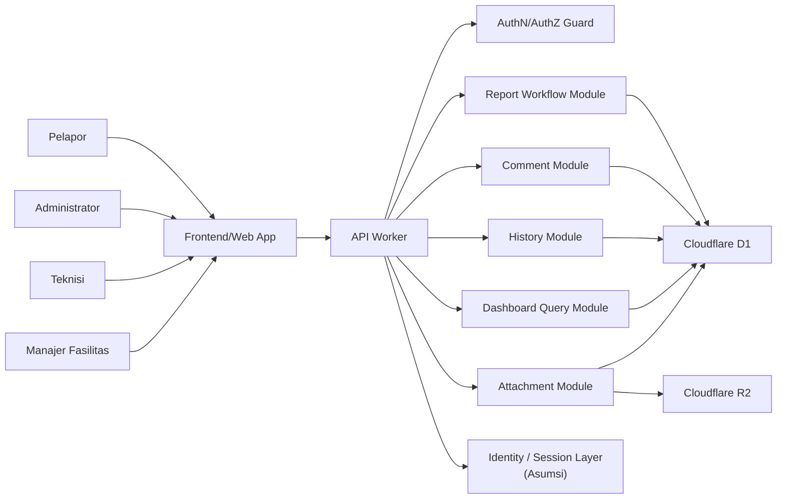

# Campus Service Request and Maintenance System - Architecture Design

## 1. Architecture Summary
- Project Name: Campus Service Request and Maintenance System
- Architecture Style: Edge-first modular monolith with layered web SPA and managed storage on Cloudflare
- Main Goal: Mendukung pelaporan fasilitas, peninjauan laporan, penugasan teknisi, pembaruan status pekerjaan, komentar, audit trail, dan dashboard sederhana secara terpusat
- Key Constraints:
  - Scope MVP mengikuti requirement yang sudah diprioritaskan
  - Backend yang tersedia di repo adalah Cloudflare Worker
  - Tidak ada SLA, RPO, RTO, atau volume trafik yang terukur pada sumber
  - Mekanisme identitas final belum dipilih
  - Dashboard minimum, close/reopen final, dan notifikasi channel masih pending validation
- Assumptions:
  - Asumsi: Web SPA adalah antarmuka utama untuk semua peran
  - Asumsi: Cloudflare D1 menjadi system of record untuk data laporan terstruktur dan riwayat status
  - Asumsi: Cloudflare R2 dipakai untuk lampiran foto
  - Asumsi: Session/identity layer menyediakan `actor_id`, `actor_name`, dan `actor_role` saat request tervalidasi

## 2. System Actors
| Actor | Description | Main Responsibilities | Related Requirement ID |
|---|---|---|---|
| Pelapor | Mahasiswa atau dosen yang melaporkan masalah fasilitas | Membuat laporan, melihat daftar/detail laporan, menambah komentar, dan mengonfirmasi hasil | FR-001, FR-002, FR-003, FR-004, FR-010, FR-012 |
| Administrator | Pengelola laporan operasional | Memeriksa laporan, menentukan kategori dan prioritas, menugaskan teknisi, dan menutup atau membuka kembali laporan | FR-005, FR-006, FR-007, FR-008, FR-012 |
| Teknisi | Petugas maintenance | Menerima tugas, memperbarui progres, menolak tugas dengan alasan, dan menandai pekerjaan selesai | FR-008, FR-009, FR-011 |
| Manajer Fasilitas | Pengawas fasilitas | Melihat dashboard ringkas dan memantau ringkasan operasional | FR-013 |
| Cloudflare Worker API | Edge backend | Menegakkan authz, business rule, workflow status, history, comment, dashboard query, dan attachment orchestration | FR-001 sampai FR-013 |
| Cloudflare D1 | Managed relational storage | Menjadi system of record untuk reports, comments, history, assignments, dan agregat dashboard | FR-001, FR-003, FR-004, FR-005, FR-006, FR-007, FR-008, FR-009, FR-010, FR-011, FR-013 |
| Cloudflare R2 | Managed object storage | Menyimpan lampiran foto laporan | FR-001 |

## 3. Main Components
| Component | Responsibility | Used By | Related Requirement ID |
|---|---|---|---|
| Frontend/Web App | Menyajikan UI role-aware, form laporan, daftar, detail, komentar, dan dashboard | Pelapor, Administrator, Teknisi, Manajer Fasilitas | FR-001 sampai FR-013, NFR-004 |
| API Worker | Menangani request browser, validasi, otorisasi, dan routing business flow | Frontend/Web App | FR-001 sampai FR-013, NFR-001, NFR-002, NFR-003, NFR-006 |
| Report Workflow Module | Mengelola create report, review, priority, assign, status transition, close, reopen | API Worker | FR-001, FR-002, FR-005, FR-006, FR-007, FR-008, FR-009, FR-011, FR-012 |
| Comment Module | Menyimpan komentar/catatan dan menampilkan thread komentar | API Worker | FR-004, FR-010 |
| History Module | Menulis riwayat status secara append-only setiap perubahan status | API Worker | FR-011, NFR-002 |
| Dashboard Query Module | Mengambil agregat status, kategori, prioritas, dan rata-rata waktu penyelesaian | API Worker | FR-013 |
| Attachment Module | Memvalidasi dan menyimpan metadata lampiran foto serta referensi objek R2 | API Worker, Cloudflare R2 | FR-001 |
| AuthN/AuthZ Guard | Memvalidasi session dan role serta membatasi akses resource | API Worker | NFR-001, FR-003, FR-004 |
| Notification Hook [Asumsi] | Mencatat event notifikasi untuk tindakan yang memerlukan pemberitahuan tanpa menentukan channel final | API Worker | FR-007, FR-008, FR-011, FR-012 |

## 4. Architecture Diagram

## 5. Component Responsibilities
### Frontend/Web App
- Menyediakan interface untuk semua peran dengan route yang role-aware.
- Mengumpulkan input form, menampilkan daftar dan detail laporan, serta memperlihatkan feedback loading, empty, error, dan success.
- Memastikan UI tetap usable pada desktop, tablet, dan mobile sesuai output UI design.

### Backend/API
- Menjadi satu titik enforcement untuk authz, business rules, status transition, komentar, history, assignment, dashboard, dan attachment orchestration.
- Menulis ke D1 dan R2 melalui satu write path yang konsisten agar audit trail tidak terpisah dari perubahan status.
- Menyiapkan boundary yang jelas untuk role-based access, validation, and error handling.

### Database
- Menyimpan laporan, komentar, riwayat status, penugasan, dan metadata lampiran sebagai system of record.
- Menjadi sumber data untuk daftar laporan, detail laporan, dan dashboard ringkas.
- Menjaga consistency boundary pada transaksi yang melibatkan status update dan history write.

### Authentication and Authorization
- Memvalidasi session dan klaim peran sebelum request sensitif diproses.
- Menegakkan least privilege per actor dan per resource.
- Menyediakan snapshot identitas minimum untuk audit trail.

### Notification Service
- Notifikasi tugas baru, status pekerjaan, dan hasil penutupan laporan dibuat sebagai event internal terlebih dahulu.
- Channel penyampaian final masih TBD, sehingga arsitektur hanya menyiapkan hook/event writer dan bukan provider final.
- Jika channel tambahan disetujui nanti, komponen ini dapat diperluas tanpa mengubah workflow inti.

## 6. Actor to Component Mapping
| Actor | Component Used | Main Actions |
|---|---|---|
| Pelapor | Frontend/Web App, API Worker, Report Workflow Module, Comment Module, Attachment Module | Membuat laporan, melihat daftar/detail, menambah komentar, mengunggah foto, mengonfirmasi hasil |
| Administrator | Frontend/Web App, API Worker, Report Workflow Module, History Module, Notification Hook | Memeriksa laporan, menetapkan prioritas, menugaskan teknisi, menutup atau membuka kembali laporan |
| Teknisi | Frontend/Web App, API Worker, Report Workflow Module, History Module, Comment Module | Menerima tugas, memperbarui progres, menolak tugas dengan alasan, menyelesaikan pekerjaan |
| Manajer Fasilitas | Frontend/Web App, API Worker, Dashboard Query Module | Melihat dashboard ringkas dan agregat operasional |

## 7. Service Request Status Flow
| Status | Trigger | Responsible Actor | Responsible Component | Next Status | Related Requirement ID |
|---|---|---|---|---|---|
| Baru | Pelapor mengirim form laporan | Pelapor | Frontend/Web App, API Worker, Report Workflow Module | Diperiksa | FR-001, FR-002, UC-01 |
| Diperiksa | Administrator meninjau laporan dan menetapkan kategori | Administrator | API Worker, Report Workflow Module | Ditugaskan atau Ditolak | FR-005 |
| Ditolak | Administrator menolak laporan yang tidak valid | Administrator | API Worker, Report Workflow Module | - | FR-005, BR-005 |
| Ditugaskan | Administrator memilih teknisi | Administrator | API Worker, Report Workflow Module, Notification Hook [Asumsi] | Diterima | FR-007, FR-008 |
| Diterima | Teknisi menerima tugas | Teknisi | API Worker, Report Workflow Module | Sedang Dikerjakan | FR-009 |
| Sedang Dikerjakan | Teknisi memperbarui progres | Teknisi | API Worker, Report Workflow Module | Selesai Dikerjakan | FR-009 |
| Selesai Dikerjakan | Teknisi menandai pekerjaan selesai | Teknisi | API Worker, Report Workflow Module, Notification Hook [Asumsi] | Ditutup atau Dibuka Kembali | FR-009, FR-011, FR-012 |
| Ditutup | Administrator menutup laporan setelah konfirmasi pelapor | Administrator | API Worker, Report Workflow Module, History Module | - | FR-012, UC-11 |
| Dibuka Kembali | Administrator membuka kembali karena hasil belum sesuai | Administrator | API Worker, Report Workflow Module, History Module | Ditugaskan | FR-012, UC-11 |

## 8. Requirement to Architecture Mapping
| Requirement ID | Requirement Summary | Supporting Component | Architecture Decision |
|---|---|---|---|
| FR-001 | Membuat laporan baru dengan lampiran foto opsional | Frontend/Web App, API Worker, Report Workflow Module, Attachment Module, Cloudflare D1, Cloudflare R2 | Satu write path untuk laporan + metadata lampiran |
| FR-002 | Validasi field minimum laporan | Frontend/Web App, API Worker, Report Workflow Module | Validasi dilakukan di UI dan backend |
| FR-003 | Melihat daftar laporan sesuai hak akses | Frontend/Web App, API Worker, AuthN/AuthZ Guard, Report Workflow Module | Role-based access per resource |
| FR-004 | Melihat detail laporan lengkap | Frontend/Web App, API Worker, Report Workflow Module, Comment Module, History Module | Detail page membaca data terstruktur dan timeline dari D1 |
| FR-005 | Memeriksa laporan dan menetapkan kategori | API Worker, Report Workflow Module | Status transition dipusatkan pada backend |
| FR-006 | Menentukan prioritas laporan | API Worker, Report Workflow Module | Prioritas hanya diset pada backend setelah role valid |
| FR-007 | Menugaskan teknisi | API Worker, Report Workflow Module, Notification Hook [Asumsi] | Assignment menjadi pemicu event notifikasi |
| FR-008 | Status laporan berubah menjadi Ditugaskan setelah assignment | API Worker, Report Workflow Module, History Module | Update assignment dan status dilakukan konsisten |
| FR-009 | Teknisi mengubah status pekerjaan | API Worker, Report Workflow Module, History Module | Semua transisi teknisi menulis history |
| FR-010 | Komentar/catatan pada laporan | Frontend/Web App, API Worker, Comment Module | Komentar disimpan append-only |
| FR-011 | Riwayat status otomatis | API Worker, History Module, Cloudflare D1 | Audit trail append-only |
| FR-012 | Menutup atau membuka kembali laporan | API Worker, Report Workflow Module, History Module, Notification Hook [Asumsi] | Close/reopen dikelola di satu workflow service |
| FR-013 | Dashboard sederhana | API Worker, Dashboard Query Module, Cloudflare D1 | Query agregat di backend, bukan di frontend |

## 9. Non-Functional Requirement Mapping
| NFR ID | Quality Attribute | Architecture Decision | Verification Method |
|---|---|---|---|
| NFR-001 | Security | AuthN/AuthZ guard pada API Worker dengan role-based resource check | Integration test request tanpa role valid menghasilkan 401/403 |
| NFR-002 | Auditability | History Module append-only di D1 untuk setiap perubahan status | Query history menunjukkan old_status, new_status, actor, timestamp |
| NFR-003 | Data Integrity | D1 menjadi system of record; write path konsisten untuk report/comment/history/assignment | FK, constraint, dan transaction boundary diuji |
| NFR-004 | Usability | UI role-aware dan label status konsisten dengan domain yang divalidasi | UI review dan contract test terhadap status label |
| NFR-005 | Availability | Managed Cloudflare Worker/D1/R2 dengan graceful error handling di API | Smoke test saat D1/R2 unavailable dan response aman |
| NFR-006 | Observability | Structured logs dan correlation ID pada API Worker | Log inspection per request end-to-end |
| NFR-007 | Performance | Index dan query read-only untuk daftar, detail, dan dashboard | Smoke/performance test pada list/detail/dashboard |

## 10. Data and Integration Boundary
- Internal Data:
  - Laporan, komentar, assignment, history status, dan metadata lampiran disimpan di Cloudflare D1 sebagai system of record.
  - Snapshot identitas minimal disimpan pada data domain untuk audit trail.
- External Systems:
  - Identity / Session Layer [Asumsi]
  - Tidak ada integrasi eksternal lain yang divalidasi pada scope ini.
- File Storage:
  - Lampiran foto disimpan di Cloudflare R2.
  - Metadata lampiran tetap berada di D1.
- Notification Channel:
  - Event notifikasi dipicu dari API Worker.
  - Channel final masih TBD dan tidak diasumsikan sebagai email atau push tertentu.
- Out of Scope:
  - Sistem fasilitas kampus eksternal, payment, inventory, dan analytics lanjutan tidak termasuk scope saat ini.

## 11. Architecture Decisions
| Decision ID | Decision | Reason | Requirement Supported | Trade-off |
|---|---|---|---|---|
| ADR-001 | Gunakan edge-first modular monolith pada Cloudflare Worker | Scope MVP belum membutuhkan distributed system dan repo sudah menyiapkan Worker | FR-001 sampai FR-013, NFR-001 sampai NFR-007 | Lebih sederhana, tetapi boundary modul harus disiplin |
| ADR-002 | Gunakan Cloudflare D1 sebagai system of record | Requirement butuh transaksi, filter, history, dan dashboard agregat | FR-001 sampai FR-013, NFR-002, NFR-003 | Membutuhkan skema dan indeks yang rapi |
| ADR-003 | Gunakan Cloudflare R2 untuk lampiran foto | Lampiran adalah object terpisah dari data laporan terstruktur | FR-001 | Perlu metadata dan cleanup policy |
| ADR-004 | Tunda pemilihan channel notifikasi final | Notifikasi disebut dalam use case, tetapi provider/channel belum disepakati | FR-007, FR-008, FR-011, FR-012 | Arsitektur siap diperluas tanpa mengunci provider |
| ADR-005 | Tidak memakai microservices untuk MVP | Tidak ada driver skala/operasi yang memaksa distribusi | Semua requirement inti | Menghindari kompleksitas jaringan dan operasional |

## 12. Risks and Mitigations
| Risk | Impact | Mitigation | Owner/TBD |
|---|---|---|---|
| Identity provider final belum ditetapkan | Authz dan audit trail bisa berubah | Gunakan adapter session minimal dan jangan hardcode provider | TBD |
| Label status UI/API tidak sinkron | Pengguna bingung dan data menyesatkan | Kunci mapping status di satu domain glossary | Backend + UI lead |
| Dashboard minimum belum disepakati | Layout dan query agregat dapat berubah | Finalisasi metrik minimum sebelum hardening | Product Owner / Manajer Fasilitas |
| Channel notifikasi belum final | Notifikasi teknisi/pelapor bisa salah implementasi | Simpan event hook internal dan tunda provider final | Sponsor Proyek |
| Retensi lampiran belum jelas | Storage cost dan cleanup berisiko | Tetapkan retention policy sebelum implementasi upload | Product Owner |

## 13. Open Questions
- Apakah identity provider akan eksternal atau session login internal?
- Apakah notifikasi harus in-app saja atau perlu channel tambahan?
- Apakah aksi `Simpan Draft` pada form laporan benar-benar masuk scope final?
- Berapa metrik minimum dan default time range untuk dashboard?
- Apakah close/reopen memerlukan konfirmasi eksplisit pelapor melalui komentar, tombol, atau keduanya?
- Berapa batas ukuran lampiran dan aturan retensinya?

## 14. Quality Check Result
- Complete: Ya, konteks, driver, opsi, container, component, interaction, boundary, keputusan, risiko, dan traceability tersedia.
- Consistent: Ya, semua tabel dan diagram menggunakan model edge-first modular monolith yang sama.
- Traceable: Ya, requirement inti dipetakan ke component, interaction, dan decision.
- Testable: Ya, setiap NFR utama memiliki metode verifikasi.
- Simple Enough: Ya, microservices tidak dipilih karena tidak ada driver distribusi yang kuat.
- Supports Functional Requirements: Ya, semua FR inti punya komponen penanggung jawab.
- Supports Non-Functional Requirements: Ya, security, auditability, data integrity, observability, dan operability didukung keputusan arsitektur.

