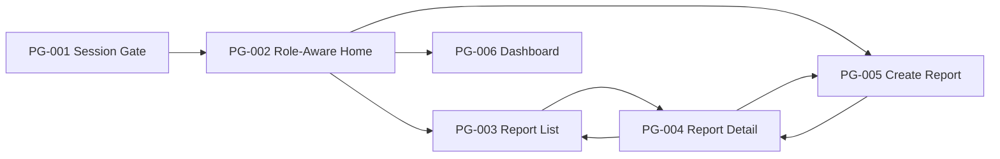

# Campus Service Request and Maintenance System - UI Flow

## 1. Ringkasan
- Nama produk/fitur: Campus Service Request and Maintenance System
- Tujuan bisnis: Menyediakan alur UI yang jelas untuk pelaporan fasilitas, triase laporan, penugasan teknisi, update progres, komentar, dan monitoring dashboard.
- Target pengguna: Pelapor, Administrator, Teknisi, dan Manajer Fasilitas.
- Platform dan viewport: Responsive web SPA untuk desktop, tablet, dan mobile.
- Ruang lingkup: Alur akses sesi, beranda role-aware, daftar laporan, detail laporan, buat laporan baru, triase dan assignment, update progres teknisi, komentar, lampiran foto, close/reopen, dan dashboard ringkas.
- Di luar ruang lingkup: Identity provider final, notifikasi channel final, dan analytics lanjutan di luar dashboard ringkas.

## 2. Konteks dan Asumsi
### 2.1 Sumber yang Ditinjau
| Source ID | Sumber | Ringkasan | Relevansi |
|---|---|---|---|
| SRC-001 | [output-specification.md](/D:/queen/sem8/finance-ai-frontend/campus-maintenance/docs/requirements/output-specification.md) | Memuat FR, NFR, user story, acceptance criteria, business rules, dan traceability. | Sumber utama alur pengguna dan state bisnis. |
| SRC-002 | [output-architecture-design.md](/D:/queen/sem8/finance-ai-frontend/campus-maintenance/docs/design/output-architecture-design.md) | Menetapkan arsitektur edge-first modular monolith, actor, dan boundary komponen. | Menentukan batasan UI dan akses per peran. |
| SRC-003 | [output-database-schema.md](/D:/queen/sem8/finance-ai-frontend/campus-maintenance/docs/design/output-database-schema.md) | Memuat entity, relasi, status flow, dan data rules. | Menentukan data yang tampil dan perubahan state yang sah. |
| SRC-004 | [output-api-contract.md](/D:/queen/sem8/finance-ai-frontend/campus-maintenance/docs/design/output-api-contract.md) | Menjelaskan endpoint, role access, error, dan response. | Menentukan aksi UI, loading, dan recovery state. |
| SRC-005 | [output-ui-design.md](/D:/queen/sem8/finance-ai-frontend/campus-maintenance/docs/design/output-ui-design.md) | Memuat inventory halaman, wireframe, design system, mockup, prototype, dan traceability. | Menjadi baseline visual dan navigasi yang sudah disepakati. |

### 2.2 Asumsi
| Assumption ID | Asumsi | Alasan | Validasi yang Dibutuhkan | Risiko Jika Salah |
|---|---|---|---|---|
| ASM-001 | UI utama adalah web SPA yang diakses lewat browser di desktop, tablet, dan mobile. | Selaras dengan arsitektur dan dokumen UI design. | Validasi target perangkat utama. | Jika ada platform lain, alur UI perlu diperluas. |
| ASM-002 | Session gate hanya memverifikasi akses dan tidak mendesain login provider final. | Identity provider final belum disepakati. | Validasi mekanisme autentikasi final. | Jika login internal dibutuhkan, perlu layar tambahan. |
| ASM-003 | Label status UI mengikuti domain yang digunakan di dokumen UI design dan API contract. | Agar daftar, detail, dan dashboard konsisten. | Validasi wording final. | Jika istilah berubah, semua copy status harus diselaraskan. |
| ASM-004 | Dashboard manajer fasilitas hanya memakai metrik ringkas yang sudah disebut di requirement. | Detail dashboard lanjutan belum final. | Validasi metrik minimum dashboard. | Jika KPI tambahan diperlukan, dashboard flow bertambah. |
| ASM-005 | Lampiran foto hanya ditampilkan sebagai preview/thumbnail dari detail dan form laporan. | Selaras dengan storage model dan UI design. | Validasi perilaku preview file. | Jika file viewer berbeda, cabang flow berubah. |

## 3. Inventaris Halaman
| Page ID | Nama Halaman | Tujuan | Pengguna | Requirement/User Story | Viewport | Status |
|---|---|---|---|---|---|---|
| PG-001 | Session Required / Access Gate | Memastikan pengguna memiliki sesi valid sebelum masuk ke aplikasi | Semua peran | NFR-001, FR-003, FR-004 | Desktop, Mobile | Draft |
| PG-002 | Beranda Role-Aware | Menjadi entry point utama berdasarkan peran | Semua peran | US-001 sampai US-005 | Desktop, Tablet, Mobile | Draft |
| PG-003 | Daftar Laporan | Menelusuri, memfilter, dan membuka laporan | Pelapor, Administrator, Teknisi | FR-003, FR-004 | Desktop, Tablet, Mobile | Draft |
| PG-004 | Detail Laporan | Melihat detail lengkap dan melakukan aksi kontekstual | Pelapor, Administrator, Teknisi | FR-004 sampai FR-012 | Desktop, Tablet, Mobile | Draft |
| PG-005 | Buat Laporan Baru | Mengisi dan mengirim laporan baru | Pelapor | FR-001, FR-002 | Desktop, Tablet, Mobile | Draft |
| PG-006 | Dashboard Manajer Fasilitas | Melihat ringkasan operasional | Manajer Fasilitas | FR-013 | Desktop, Tablet, Mobile | Pending Validation |

## 4. Flow Overview
### 4.1 Diagram Utama

### 4.2 Alur Inti per Peran
| Flow ID | Nama Flow | Entry Point | Langkah | Exit/Outcome | Alternate/Failure Path |
|---|---|---|---|---|---|
| FL-001 | Masuk dan memilih konteks peran | PG-001 | Validasi sesi -> masuk ke PG-002 -> pilih aksi sesuai peran | Pengguna sampai ke layar yang relevan | Session expired, permission denied, login required |
| FL-002 | Pelapor membuat laporan | PG-002 atau PG-003 | Klik buat laporan -> isi form -> upload foto opsional -> kirim -> lihat detail | Laporan tersimpan dengan status baru | Field wajib gagal, upload gagal, submit error |
| FL-003 | Pelapor meninjau detail dan komentar | PG-003 atau notifikasi internal dari home | Buka detail -> baca history -> tambah komentar -> lihat hasil terbaru | Komentar tersimpan dan detail tetap terbuka | Akses ditolak, data tidak ditemukan, komentar gagal |
| FL-004 | Administrator triase dan assignment | PG-003 atau PG-004 | Buka laporan -> periksa -> pilih kategori dan prioritas -> pilih teknisi -> simpan | Status berubah dan teknisi tampil di detail | Status conflict, teknisi tidak tersedia, hak akses ditolak |
| FL-005 | Teknisi menerima dan mengerjakan tugas | PG-002 atau PG-004 | Buka tugas -> terima tugas -> update progres -> tandai selesai | Status bergerak ke proses dan selesai | Invalid transition, bukan assignment milik sendiri |
| FL-006 | Administrator close atau reopen | PG-004 | Review hasil -> tutup atau buka kembali -> simpan alasan jika perlu | Laporan ditutup atau kembali ke alur penugasan | Konfirmasi hasil belum lengkap, status conflict |
| FL-007 | Manajer memantau dashboard | PG-002 atau PG-006 | Buka dashboard -> baca ringkasan -> ubah rentang waktu jika tersedia -> buka detail | Ringkasan operasional terlihat | Dashboard minimum belum tersedia, data kosong |

## 5. Flow Detail
### FL-001 - Masuk dan Memilih Konteks Peran
- Entry point: PG-001
- Langkah:
  1. Pengguna membuka aplikasi.
  2. Sistem memeriksa session valid.
  3. Jika valid, sistem mengarahkan pengguna ke PG-002.
  4. PG-002 menampilkan CTA sesuai role.
- Exit/Outcome: Pengguna masuk ke halaman yang sesuai perannya.
- Alternate/Failure Path:
  - Jika session tidak valid, PG-001 menampilkan pesan aman dan CTA untuk lanjut ke sesi.
  - Jika role tidak diizinkan untuk akses tertentu, PG-001 atau PG-002 menampilkan state permission denied.

### FL-002 - Pelapor Membuat Laporan
- Entry point: PG-002 atau PG-003
- Langkah:
  1. Pelapor memilih `Buat Laporan Baru`.
  2. Sistem membuka PG-005.
  3. Pelapor mengisi `location`, `issue_type`, dan `description`.
  4. Pelapor mengunggah foto jika ada.
  5. Pelapor menekan `Kirim Laporan`.
  6. Sistem menampilkan success state dan navigasi ke PG-004 laporan baru.
- Exit/Outcome: Laporan tersimpan dengan status awal `Baru`.
- Alternate/Failure Path:
  - Field wajib kosong memunculkan inline validation.
  - Upload gagal menampilkan error spesifik pada area lampiran.
  - Submit gagal menampilkan banner error dan tetap di PG-005.

### FL-003 - Pelapor Meninjau Detail dan Komentar
- Entry point: PG-003 atau PG-004 dari konteks sebelumnya
- Langkah:
  1. Pelapor membuka PG-004 dari daftar atau beranda.
  2. Sistem memuat detail laporan, komentar, lampiran, dan history.
  3. Pelapor membaca status terbaru dan komentar sebelumnya.
  4. Pelapor menulis komentar baru bila diperlukan.
  5. Sistem menyimpan komentar dan memperbarui thread.
- Exit/Outcome: Komentar tercatat dan detail tetap konsisten.
- Alternate/Failure Path:
  - Jika laporan tidak ditemukan, sistem menampilkan state not found.
  - Jika akses tidak sesuai, sistem menampilkan permission denied.

### FL-004 - Administrator Triase dan Assignment
- Entry point: PG-003 atau PG-004
- Langkah:
  1. Administrator membuka laporan dengan status yang dapat ditangani.
  2. Administrator memeriksa detail dan menentukan kategori serta prioritas.
  3. Administrator membuka drawer/sheet assignment.
  4. Administrator memilih teknisi.
  5. Sistem menyimpan assignment dan memperbarui status menjadi `Ditugaskan`.
  6. PG-004 menampilkan assignee dan history terbaru.
- Exit/Outcome: Laporan masuk ke alur kerja teknisi.
- Alternate/Failure Path:
  - Jika status sudah berubah, sistem menolak simpan dengan conflict state.
  - Jika teknisi tidak valid, sistem menampilkan error input.

### FL-005 - Teknisi Menerima dan Mengerjakan Tugas
- Entry point: PG-002 atau PG-004
- Langkah:
  1. Teknisi membuka tugas yang ditugaskan kepadanya.
  2. Teknisi menekan `Terima Tugas`.
  3. Sistem mengubah status menjadi `Diterima`.
  4. Teknisi menekan `Mulai Dikerjakan`.
  5. Sistem mengubah status menjadi `Sedang Dikerjakan`.
  6. Teknisi menekan `Selesai Dikerjakan`.
  7. Sistem mengubah status menjadi `Selesai Dikerjakan`.
- Exit/Outcome: Progress kerja tercatat penuh di detail laporan.
- Alternate/Failure Path:
  - Jika bukan assignment miliknya, sistem menolak aksi.
  - Jika transisi tidak sah, sistem menampilkan conflict state.

### FL-006 - Close atau Reopen oleh Administrator
- Entry point: PG-004
- Langkah:
  1. Administrator melihat laporan yang sudah selesai.
  2. Administrator memilih `Tutup Laporan` atau `Buka Kembali`.
  3. Jika perlu, sistem meminta alasan atau catatan singkat.
  4. Sistem menyimpan status akhir dan history baru.
- Exit/Outcome: Laporan ditutup atau kembali ke alur penugasan.
- Alternate/Failure Path:
  - Jika konfirmasi hasil belum terpenuhi, close ditolak.
  - Jika status tidak cocok, reopen ditolak.

### FL-007 - Manajer Memantau Dashboard
- Entry point: PG-002 atau PG-006
- Langkah:
  1. Manajer Fasilitas membuka dashboard.
  2. Sistem memuat ringkasan status, prioritas, kategori, dan waktu penyelesaian.
  3. Jika tersedia, manajer mengubah rentang waktu.
  4. Manajer membuka laporan yang menarik perhatian dari kartu ringkasan.
- Exit/Outcome: Manajer mendapatkan gambaran operasional.
- Alternate/Failure Path:
  - Jika data tidak tersedia, sistem menampilkan empty state.
  - Jika dashboard minimum belum disepakati, halaman menampilkan copy pending validation.

## 6. State dan Transisi UI
| UI State | Pemicu | Tindakan Sistem | Tindakan Pengguna | Catatan |
|---|---|---|---|---|
| Loading | Navigasi ke halaman, fetch data, submit form | Menampilkan skeleton/spinner | Menunggu atau membatalkan | Harus konsisten di semua page |
| Empty | Daftar kosong, komentar kosong, dashboard kosong | Menampilkan empty copy dan CTA | Filter ulang atau membuat laporan | Empty state harus jelas, bukan error |
| Error | Network error, validation gagal, storage error | Menampilkan banner atau inline error | Memperbaiki input atau mencoba lagi | Error aman tanpa bocor detail internal |
| Permission Denied | Role tidak berwenang | Menyembunyikan aksi dan menampilkan pesan aman | Kembali ke halaman yang diizinkan | Tidak boleh memunculkan aksi tersembunyi sebagai enabled |
| Success | Submit laporan, assignment, komentar, status update | Menampilkan toast atau banner sukses | Lanjut ke detail atau kembali | Success feedback harus singkat |
| Stale Data | Status berubah oleh actor lain | Menampilkan conflict state dan refresh prompt | Muat ulang detail | Penting pada triase dan assignment |

## 7. Traceability Ringkas
| Requirement/User Story | Page ID | Flow ID | Status |
|---|---|---|---|
| FR-001, FR-002 / US-001 | PG-005 | FL-002 | Draft |
| FR-003, FR-004 / US-002 | PG-003, PG-004 | FL-003 | Draft |
| FR-005, FR-006, FR-007, FR-008 / US-003 | PG-003, PG-004 | FL-004 | Draft |
| FR-009 / US-004 | PG-004 | FL-005 | Draft |
| FR-010, FR-011 | PG-004 | FL-003 | Draft |
| FR-012 | PG-004 | FL-006 | Pending Validation |
| FR-013 / US-005 | PG-006 | FL-007 | Pending Validation |
| NFR-001 | PG-001, PG-002, PG-003, PG-004 | FL-001 | Draft |

## 8. Gap, Konflik, dan Pertanyaan Terbuka
### Gap
- Identity provider final belum ditetapkan, jadi flow autentikasi hanya sampai gate dan permission state.
- Detail perilaku `close/reopen` masih pending validation.
- Metrik minimum dashboard belum difinalkan.

### Konflik
- Tidak ada konflik eksplisit antar dokumen sumber.
- Ada ketegangan kecil antara kebutuhan dashboard ringkas dan kemungkinan analytics tambahan, tetapi analytics tambahan di luar scope.

### Pertanyaan Terbuka
- Apakah PG-001 menampilkan login formal atau hanya redirect ke sesi eksternal?
- Apakah `Simpan Draft` pada form laporan perlu dimasukkan ke flow final?
- Apakah komentar di detail laporan juga bisa dipakai sebagai konfirmasi hasil?
- Apakah dashboard awal perlu filter waktu wajib atau cukup default ringkas?

## 9. Quality Check Result
| Check | Result | Temuan/Bukti | Tindakan |
|---|---|---|---|
| Lengkap | Lulus | Semua flow inti dan halaman utama sudah dipetakan. | Tidak ada. |
| Konsisten | Lulus | Flow mengikuti role, status, dan boundary arsitektur yang ada. | Review saat finalisasi implementasi. |
| Traceable | Lulus | Setiap flow terhubung ke requirement dan page id. | Tidak ada. |
| Tidak ambigu | Lulus | Setiap flow memiliki entry, langkah, outcome, dan failure path. | Tidak ada. |
| Dapat divalidasi | Lulus | Transisi UI dan state kritis dapat diuji secara manual. | Uji dengan stakeholder. |
| Siap handoff | Lulus | Cukup presisi untuk dipakai implementasi UI flow. | Finalisasi copy dan behavior saat coding. |
