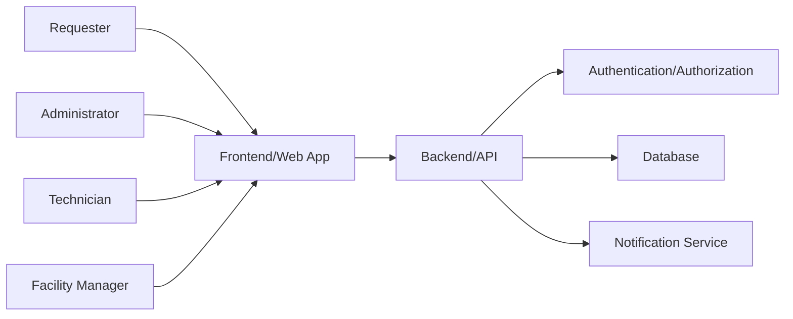
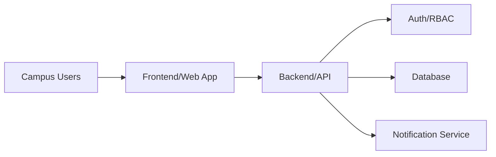

---

name: 06-architecture-design
description: Menentukan arsitektur aplikasi untuk proyek Campus Service Request and Maintenance System berdasarkan requirements yang sudah divalidasi. Gunakan skill ini ketika perlu merancang komponen frontend, backend/API, database, autentikasi, role access, alur status service request, integrasi notifikasi, dan batasan teknologi sebelum masuk ke Database/API Design atau implementasi.
---

# 06 Architecture Design

## Tujuan
Menentukan arsitektur utama aplikasi Campus Service Request and Maintenance System, termasuk pembagian komponen frontend, backend/API, database, autentikasi, notifikasi, dan layanan pendukung lain.

Skill ini memastikan struktur sistem mendukung proses pelaporan kerusakan fasilitas kampus, peninjauan laporan, penugasan teknisi, pembaruan status pekerjaan, dan monitoring maintenance secara jelas, sederhana, dan dapat ditelusuri ke requirement.

Hasil skill ini menjadi dasar untuk Database Design, API Design, UI Design, Issue Planning, dan Implementation.

## Kapan Digunakan
Gunakan skill ini setelah requirement, user story, acceptance criteria, dan business rules proyek sudah tersedia atau cukup jelas.

Gunakan juga ketika:
- Tim perlu menentukan struktur sistem sebelum membuat database dan endpoint API.
- Ada perubahan requirement besar yang memengaruhi komponen, role, data, integrasi, atau alur status.
- Tim perlu membuat diagram arsitektur aplikasi.
- Reviewer meminta bukti bahwa arsitektur mendukung functional dan non-functional requirements.
- Tim perlu memastikan sistem tetap sederhana untuk proyek mahasiswa atau tim kecil.

Jangan gunakan skill ini untuk membuat skema tabel database detail, daftar endpoint API detail, wireframe UI, atau kode implementasi. Bagian tersebut dikerjakan pada skill lanjutan.

## Input
Informasi berikut harus tersedia sebelum skill dijalankan:
- Dokumen functional requirements dan non-functional requirements.
- User stories dan acceptance criteria.
- Business rules terkait service request dan maintenance.
- Daftar aktor sistem, minimal:
  - Pelapor atau Requester.
  - Administrator.
  - Teknisi.
  - Manajer Fasilitas atau Supervisor.
- Alur status service request, misalnya:
  - Submitted.
  - Under Review.
  - Assigned.
  - In Progress.
  - Resolved.
  - Closed.
  - Rejected atau Cancelled jika memang ada di requirement.
- Batasan teknologi proyek, misalnya framework frontend, backend, database, hosting, dan layanan pihak ketiga.
- Fitur opsional yang sudah disetujui, misalnya upload foto, notifikasi email, dashboard analytics, atau export laporan.
- Batasan keamanan, privasi data, performa, availability, dan audit trail jika tersedia.

Jika informasi belum lengkap, lanjutkan hanya pada bagian yang dapat divalidasi dan tandai sisanya sebagai asumsi atau pertanyaan terbuka.

## Required Context
Baca konteks berikut sebelum merancang arsitektur:
- Requirement ID seperti `FR-01`, `NFR-01`, `BR-01`, atau ID sementara jika dokumen belum memberi ID.
- Dokumen requirement terkait role dan permission.
- Dokumen requirement terkait pembuatan, validasi, penugasan, pengerjaan, penyelesaian, dan penutupan service request.
- Dokumen requirement terkait data fasilitas, lokasi, kategori kerusakan, prioritas, teknisi, dan riwayat status.
- Dokumen UI design jika sudah tersedia.
- Dokumen database/API design jika arsitektur sedang diperbarui dari desain yang sudah ada.
- Struktur repository jika proyek sudah berjalan.
- Keputusan teknologi yang sudah disetujui oleh tim, dosen, atau stakeholder.

Jangan menebak teknologi, layanan cloud, role, atau fitur tambahan jika tidak ada di konteks. Catat sebagai `TBD` atau pertanyaan terbuka.

## Langkah Kerja
1. Baca seluruh requirement, user story, acceptance criteria, dan business rules yang tersedia.
2. Identifikasi aktor utama dan tujuan masing-masing aktor dalam sistem.
3. Identifikasi komponen utama aplikasi:
   - Frontend/Web App.
   - Backend/API.
   - Database.
   - Authentication dan Authorization.
   - File Storage jika upload foto/dokumen disetujui.
   - Notification Service jika notifikasi disetujui.
   - Admin/Dashboard module jika dibutuhkan.
   - Reporting/Analytics module jika tersedia di requirement.
4. Tentukan tanggung jawab tiap komponen dalam satu sampai tiga kalimat.
5. Tentukan pola komunikasi antar komponen, misalnya browser mengakses frontend, frontend memanggil REST API, backend membaca/menulis database, backend memicu notifikasi.
6. Petakan setiap aktor ke komponen dan fitur yang digunakan.
7. Petakan alur status service request ke komponen yang bertanggung jawab mengubah status.
8. Petakan requirement functional ke komponen arsitektur agar setiap fitur wajib memiliki tempat dalam sistem.
9. Petakan non-functional requirements ke keputusan arsitektur, misalnya security, auditability, performance, availability, maintainability, dan scalability.
10. Tentukan boundary sistem: apa yang berada di dalam aplikasi dan apa yang berada di luar aplikasi.
11. Identifikasi integrasi eksternal jika ada, seperti email service, SSO kampus, payment, inventory, atau sistem fasilitas kampus.
12. Buat diagram arsitektur sederhana menggunakan teks, kotak-panah, atau Mermaid.
13. Buat daftar keputusan arsitektur beserta alasan dan requirement yang didukung.
14. Catat asumsi, risiko, constraint, dan pertanyaan terbuka.
15. Lakukan quality check.
16. Hentikan jika requirement belum cukup, bertentangan, atau arsitektur tidak dapat divalidasi.

## Output
Buat file `campus-service-request-maintenance-architecture.md` yang berisi:

```markdown
# Campus Service Request and Maintenance System - Architecture Design

## 1. Architecture Summary
- Project Name:
- Architecture Style:
- Main Goal:
- Key Constraints:
- Assumptions:

## 2. System Actors
| Actor | Description | Main Responsibilities | Related Requirement ID |
|---|---|---|---|
| Requester | ... | ... | FR-01 |

## 3. Main Components
| Component | Responsibility | Used By | Related Requirement ID |
|---|---|---|---|
| Frontend/Web App | ... | Requester, Admin, Technician | FR-01, FR-02 |

## 4. Architecture Diagram


## 5. Component Responsibilities
### Frontend/Web App
- ...

### Backend/API
- ...

### Database
- ...

### Authentication and Authorization
- ...

### Notification Service
- ...

## 6. Actor to Component Mapping
| Actor | Component Used | Main Actions |
|---|---|---|
| Requester | Frontend/Web App, Backend/API | Submit request, track status |

## 7. Service Request Status Flow
| Status | Trigger | Responsible Actor | Responsible Component | Next Status | Related Requirement ID |
|---|---|---|---|---|---|
| Submitted | Request created | Requester | Frontend/API | Under Review | FR-01 |

## 8. Requirement to Architecture Mapping
| Requirement ID | Requirement Summary | Supporting Component | Architecture Decision |
|---|---|---|---|
| FR-01 | ... | Frontend, Backend/API, Database | ... |

## 9. Non-Functional Requirement Mapping
| NFR ID | Quality Attribute | Architecture Decision | Verification Method |
|---|---|---|---|
| NFR-01 | Security | Role-based access control | Authorization tests |

## 10. Data and Integration Boundary
- Internal Data:
- External Systems:
- File Storage:
- Notification Channel:
- Out of Scope:

## 11. Architecture Decisions
| Decision ID | Decision | Reason | Requirement Supported | Trade-off |
|---|---|---|---|---|
| ADR-01 | ... | ... | NFR-01 | ... |

## 12. Risks and Mitigations
| Risk | Impact | Mitigation | Owner/TBD |
|---|---|---|---|
| ... | ... | ... | TBD |

## 13. Open Questions
- ...

## 14. Quality Check Result
- Complete:
- Consistent:
- Traceable:
- Testable:
- Simple Enough:
- Supports Functional Requirements:
- Supports Non-Functional Requirements:
```

Jika pengguna meminta versi ringkas, tetap hasilkan minimal:
- Ringkasan arsitektur.
- Komponen utama.
- Diagram arsitektur.
- Pemetaan aktor ke komponen.
- Alur status service request.
- Pemetaan requirement ke komponen.
- Asumsi dan pertanyaan terbuka.

## Aturan
- Jangan membuat requirement, role, status, integrasi, atau teknologi baru yang tidak diberikan.
- Tandai semua asumsi secara eksplisit dengan label `Asumsi`.
- Gunakan requirement ID ketika menghubungkan keputusan arsitektur dengan requirement.
- Jika requirement belum memiliki ID, buat ID sementara seperti `REQ-TEMP-001` dan jelaskan bahwa ID tersebut sementara.
- Pisahkan functional requirements dan non-functional requirements dalam pemetaan arsitektur.
- Jangan merancang skema database detail pada tahap ini.
- Jangan merancang endpoint API detail pada tahap ini.
- Jangan menulis kode implementasi pada tahap ini.
- Jangan menggunakan arsitektur yang terlalu kompleks untuk kebutuhan proyek, seperti microservices, event streaming, atau distributed queue, kecuali requirement secara eksplisit membutuhkannya.
- Jangan menggunakan kata ambigu seperti `aman`, `cepat`, `mudah digunakan`, atau `scalable` tanpa menjelaskan keputusan arsitektur dan cara verifikasinya.
- Pastikan setiap komponen memiliki tanggung jawab yang jelas dan tidak tumpang tindih.
- Pastikan alur status service request memiliki aktor dan komponen penanggung jawab yang jelas.
- Pastikan keputusan teknologi tetap mengikuti batasan proyek yang diberikan.
- Jika fitur upload foto digunakan, jelaskan batas arsitektur storage tanpa membuat detail schema atau implementasi upload.
- Jika fitur notifikasi digunakan, jelaskan channel dan pemicu notifikasi tanpa menebak provider.

## Quality Check
Periksa hasil sebelum diberikan:
- Apakah setiap aktor memiliki jalur akses ke komponen yang relevan?
- Apakah setiap functional requirement terhubung ke minimal satu komponen?
- Apakah setiap non-functional requirement memiliki keputusan arsitektur dan metode verifikasi?
- Apakah setiap status service request memiliki trigger, aktor, komponen penanggung jawab, dan next status?
- Apakah diagram arsitektur mudah dipahami tanpa penjelasan panjang?
- Apakah boundary antara frontend, backend/API, database, dan layanan eksternal jelas?
- Apakah arsitektur cukup sederhana untuk proyek Campus Service Request and Maintenance System?
- Apakah semua asumsi dan pertanyaan terbuka ditandai?
- Apakah ada requirement yang belum tertampung dalam arsitektur?
- Apakah hasil siap menjadi dasar Database/API Design?

## Kondisi Gagal
Skill harus berhenti atau meminta klarifikasi jika:
- Dokumen requirement belum tersedia.
- Requirement utama belum divalidasi.
- Aktor sistem belum jelas.
- Alur status service request belum tersedia atau saling bertentangan.
- Batasan teknologi proyek belum jelas dan memengaruhi keputusan arsitektur utama.
- Requirement meminta integrasi eksternal tetapi sistem eksternal, akses, atau batasannya tidak diketahui.
- Requirement non-functional penting seperti security atau privacy bertentangan dengan keputusan teknologi yang diberikan.
- Fitur yang diminta membutuhkan layanan berbayar atau layanan eksternal tetapi belum disetujui.
- Tidak mungkin membuat diagram arsitektur tanpa menebak komponen inti.

Jika kondisi gagal terjadi, keluarkan daftar klarifikasi yang dibutuhkan dan jangan menghasilkan arsitektur final.

## Human Review
- Mahasiswa harus memeriksa apakah arsitektur sesuai dengan scope tugas dan kemampuan tim.
- Mahasiswa harus mengonfirmasi semua asumsi yang dibuat AI.
- Mahasiswa harus memastikan alur status service request sesuai dengan requirement yang disetujui.
- Mahasiswa harus memastikan batasan teknologi sudah sesuai instruksi dosen atau kampus.
- Reviewer atau dosen dapat memeriksa traceability antara requirement, komponen, dan keputusan arsitektur.
- Hasil review harus diselesaikan sebelum lanjut ke Database/API Design dan Implementation.

## Example Invocation
```text
Gunakan skill campus-service-request-maintenance-architecture untuk membuat architecture-design.md dari requirement Campus Service Request and Maintenance System. Sertakan diagram arsitektur, komponen utama, actor mapping, status flow, requirement mapping, asumsi, dan pertanyaan terbuka.
```

## Expected Output Example
```markdown
# Campus Service Request and Maintenance System - Architecture Design

## 1. Architecture Summary
- Project Name: Campus Service Request and Maintenance System
- Architecture Style: Layered web application
- Main Goal: Mendukung pelaporan, peninjauan, penugasan, pengerjaan, dan penutupan service request fasilitas kampus.
- Key Constraints: TBD
- Assumptions:
  - Asumsi: Sistem digunakan melalui web app karena platform belum disebutkan.

## 2. System Actors
| Actor | Description | Main Responsibilities | Related Requirement ID |
|---|---|---|---|
| Requester | Pengguna yang melaporkan masalah fasilitas | Membuat service request dan memantau status | FR-01 |
| Administrator | Pengelola laporan awal | Meninjau laporan dan mengatur assignment | FR-02 |
| Technician | Petugas maintenance | Memperbarui progres pekerjaan | FR-03 |
| Facility Manager | Pengawas fasilitas | Melihat dashboard dan laporan | FR-04 |

## 3. Main Components
| Component | Responsibility | Used By | Related Requirement ID |
|---|---|---|---|
| Frontend/Web App | Menyediakan UI untuk semua role | Semua aktor | FR-01, FR-02, FR-03 |
| Backend/API | Menjalankan business rules dan status transition | Frontend/Web App | FR-01, BR-01 |
| Database | Menyimpan request, user, assignment, dan status history | Backend/API | FR-01 |

## 4. Architecture Diagram


## 7. Service Request Status Flow
| Status | Trigger | Responsible Actor | Responsible Component | Next Status | Related Requirement ID |
|---|---|---|---|---|---|
| Submitted | Request dibuat | Requester | Frontend/API | Under Review | FR-01 |
| Under Review | Admin membuka laporan | Administrator | Backend/API | Assigned atau Rejected | FR-02 |
| Assigned | Teknisi dipilih | Administrator | Backend/API | In Progress | FR-03 |

## 13. Open Questions
- Apakah sistem wajib mendukung upload foto kerusakan?
- Apakah notifikasi menggunakan email, in-app notification, atau keduanya?
```
omponen, deployment, integration boundary, serta memilih pola arsitektur dan teknologi agar functional requirements dan non-functional requirements terpenuhi secara traceable.
---

# 06 Architecture Design

## Purpose
Gunakan skill ini untuk menghasilkan desain arsitektur perangkat lunak yang jelas, terukur, dapat divalidasi, dan siap menjadi acuan implementasi.

Skill ini menyelesaikan masalah batas komponen yang kabur, tanggung jawab yang tumpang tindih, interaksi antarsistem yang tidak jelas, pemilihan teknologi tanpa dasar, serta arsitektur yang tidak dapat menunjukkan bagaimana kebutuhan fungsional dan nonfungsional dipenuhi.

## When to Use
Gunakan skill ini ketika pengguna meminta bantuan untuk:

- Merancang arsitektur sistem baru atau perubahan arsitektur sistem yang ada.
- Membagi sistem menjadi domain, service, module, component, dan deployment unit.
- Menentukan tanggung jawab, ownership, dependency, interface, dan aliran data.
- Memilih pola seperti modular monolith, layered, hexagonal, microservices, event-driven, serverless, atau pola lain.
- Mengevaluasi teknologi, framework, database, messaging, cache, cloud service, dan platform.
- Merancang integrasi internal maupun eksternal.
- Memenuhi kebutuhan performance, scalability, availability, security, reliability, maintainability, observability, dan compliance.
- Membuat diagram arsitektur, Architecture Decision Record, threat/risk analysis, dan traceability matrix.
- Meninjau kelayakan dan trade-off desain arsitektur.

Jangan gunakan skill ini untuk menetapkan requirement yang belum divalidasi atau memilih teknologi berdasarkan tren tanpa kaitan dengan kebutuhan dan batasan proyek.

## Inputs
Informasi berikut harus tersedia sebelum skill dijalankan:

- Nama sistem, produk, modul, atau fitur.
- Tujuan bisnis, business value, dan ruang lingkup.
- Functional requirements, non-functional requirements, business rules, user stories, dan acceptance criteria.
- Aktor, sistem eksternal, use case, dan alur bisnis utama.
- Data utama, klasifikasi sensitivitas, ownership, volume, dan pola akses.
- Target performance, scalability, availability, reliability, security, RPO, RTO, dan compliance jika berlaku.
- Batasan teknologi, anggaran, waktu, kemampuan tim, lisensi, vendor, dan lingkungan operasional.
- Arsitektur, kode, API, database, deployment, dan infrastruktur yang sudah ada jika desain merupakan perubahan.
- Ekspektasi pertumbuhan, pola beban, lokasi pengguna, dan kebutuhan integrasi.
- Risiko, masalah operasional, technical debt, atau keputusan arsitektur terdahulu.

Jika informasi penting tidak tersedia, minta klarifikasi sebelum memfinalkan arsitektur.

## Required Context
Baca konteks proyek yang relevan sebelum merancang arsitektur:

- Dokumen elicitation, specification, prioritization, UI design, database design, dan API design.
- Product brief, business process, domain glossary, dan business rules.
- Diagram sistem, source code, module structure, dependency, dan konfigurasi yang ada.
- API contract, event schema, database schema, dan integrasi eksternal.
- Infrastructure as code, deployment pipeline, environment, dan network topology.
- Security, privacy, compliance, backup, recovery, retention, dan data residency policy.
- Monitoring, logs, traces, metrics, incident report, performance test, dan usage analytics.
- ADR atau keputusan teknologi terdahulu.
- Standar organisasi dan kemampuan operasional tim.

Gunakan hanya fakta yang tersedia. Tandai inferensi sebagai asumsi dan jangan mengarang SLA, traffic, budget, kemampuan tim, constraint, atau dukungan teknologi.

## Workflow
1. Tetapkan tujuan dan scope arsitektur.
   - Identifikasi business goal, stakeholder, use case, system boundary, dan hal di luar scope.
   - Catat constraint, assumption, dependency, dan pertanyaan terbuka.

2. Analisis architecture drivers.
   - Petakan functional requirements dan quality attributes yang paling memengaruhi desain.
   - Prioritaskan skenario NFR berdasarkan business impact dan risk.
   - Gunakan ID `DRV-001`, `DRV-002`, dan seterusnya.

3. Definisikan system context.
   - Identifikasi pengguna, sistem eksternal, trust boundary, data flow, dan protokol.
   - Gunakan ID `SYS-001` untuk sistem dan `EXT-001` untuk dependency eksternal.
   - Buat context diagram jika format mendukungnya.

4. Evaluasi opsi arsitektur.
   - Bandingkan minimal dua opsi yang layak jika pilihan belum ditetapkan.
   - Nilai setiap opsi terhadap architecture drivers, complexity, cost, operability, team fit, migration, dan risk.
   - Hindari distributed architecture jika kebutuhan dapat dipenuhi dengan desain yang lebih sederhana.

5. Definisikan container dan component.
   - Gunakan ID `CNT-001` untuk container/deployment unit dan `CMP-001` untuk component.
   - Tetapkan responsibility, ownership, interface, data owned, dependency, dan boundary.
   - Terapkan high cohesion, low coupling, dependency direction yang jelas, dan single source of truth.

6. Rancang interaksi dan aliran data.
   - Dokumentasikan skenario synchronous, asynchronous, batch, dan event-driven yang relevan.
   - Gunakan ID `INT-001` untuk interaction.
   - Definisikan sequence, protocol, contract, timeout, retry, idempotency, consistency, transaction boundary, dan failure handling.

7. Rancang data dan integration architecture.
   - Tentukan data ownership, system of record, storage, cache, replication, dan lifecycle.
   - Definisikan integration boundary, API gateway, message broker, adapter, anti-corruption layer, atau pola lain hanya jika diperlukan.
   - Hubungkan detail schema dan kontrak ke dokumen Database dan API Design.

8. Rancang deployment dan operasional.
   - Definisikan environment, runtime, network zone, scaling unit, redundancy, configuration, secret, dan dependency platform.
   - Dokumentasikan CI/CD, migration, rollback, backup, restore, disaster recovery, dan release strategy bila relevan.

9. Rancang security dan observability.
   - Definisikan authentication, authorization, least privilege, encryption, trust boundary, validation, audit, dan threat control.
   - Definisikan log, metric, trace, correlation ID, health check, alert, dashboard, dan SLO signal.

10. Pilih teknologi secara berbasis bukti.
   - Gunakan ID `TECH-001` untuk pilihan teknologi.
   - Evaluasi fit terhadap requirement, maturity, ecosystem, support, licensing, cost, performance, security, operability, dan kemampuan tim.
   - Lakukan proof of concept jika keputusan berisiko tinggi belum dapat divalidasi dari bukti yang ada.

11. Dokumentasikan keputusan dan risiko.
   - Gunakan ID `ADR-001` untuk Architecture Decision Record dan `RSK-001` untuk risiko.
   - Catat context, decision, alternatives, rationale, consequences, status, dan validation evidence.

12. Buat traceability.
   - Hubungkan requirement, driver, container, component, interaction, technology, security control, ADR, dan verification method.

13. Lakukan quality checks.
   - Periksa completeness, consistency, fitness, simplicity, security, resilience, operability, evolvability, testability, traceability, dan business value.

14. Hentikan jika informasi tidak mencukupi.
   - Jangan memfinalkan pilihan arsitektur atau teknologi jika driver, constraint, NFR, integrasi, data, atau risiko kritis belum dapat divalidasi.
   - Ajukan pertanyaan klarifikasi yang spesifik.

## Output Format
Hasilkan output dengan struktur berikut:

```markdown
# Software Architecture Design: <Nama Sistem/Fitur>

## 1. Ringkasan
- Tujuan bisnis:
- Scope:
- Di luar scope:
- Stakeholder:
- Status desain:

## 2. Konteks dan Asumsi
### 2.1 Sumber yang Ditinjau
| Source ID | Sumber | Ringkasan | Relevansi |
|---|---|---|---|

### 2.2 Asumsi dan Constraint
| ID | Tipe | Pernyataan | Validasi | Risiko Jika Salah |
|---|---|---|---|---|

## 3. Architecture Drivers
| Driver ID | Requirement/NFR | Skenario Terukur | Prioritas | Business Impact |
|---|---|---|---|---|

## 4. System Context
| System ID | Aktor/Sistem | Peran | Data/Interaksi | Trust Boundary |
|---|---|---|---|---|

### Context Diagram
<Diagram Mermaid C4-like atau diagram teks>

## 5. Evaluasi Opsi Arsitektur
| Option ID | Opsi | Kelebihan | Kekurangan | Driver Fit | Risiko | Keputusan |
|---|---|---|---|---|---|---|

## 6. Container Architecture
| Container ID | Nama | Responsibility | Technology | Data Owned | Interface | Deployment Unit |
|---|---|---|---|---|---|---|

### Container Diagram
<Diagram Mermaid atau diagram teks>

## 7. Component Design
| Component ID | Container | Responsibility | Interface | Dependency | Owner |
|---|---|---|---|---|---|

## 8. Interaction Scenarios
| Interaction ID | Skenario | Participants | Protocol/Contract | Consistency | Failure Handling |
|---|---|---|---|---|---|

### Sequence Diagram
<Diagram Mermaid untuk alur kritis>

## 9. Data dan Integration Architecture
| Item ID | Data/Integration | Owner/System of Record | Pattern | Contract/Storage | Risiko/Kontrol |
|---|---|---|---|---|---|

## 10. Deployment Architecture
| Node ID | Environment/Node | Workload | Network/Trust Zone | Scaling/Redundancy | Dependency |
|---|---|---|---|---|---|

## 11. Security dan Observability
| Control ID | Area/Risiko | Mekanisme | Enforcement/Signal | Verifikasi |
|---|---|---|---|---|

## 12. Technology Selection
| Technology ID | Area | Pilihan | Alternatif | Kriteria/Bukti | Konsekuensi |
|---|---|---|---|---|---|

## 13. Architecture Decision Records
| ADR ID | Keputusan | Context | Alternatives | Rationale | Consequences | Status |
|---|---|---|---|---|---|---|

## 14. Risiko Arsitektur
| Risk ID | Risiko | Probability | Impact | Mitigation | Validation/Owner |
|---|---|---|---|---|---|

## 15. Traceability Matrix
| Requirement/NFR | Driver ID | Container/Component | Interaction | Technology/ADR | Verification |
|---|---|---|---|---|---|

## 16. Gap dan Pertanyaan Terbuka
### Gap
-

### Pertanyaan Terbuka
-

## 17. Quality Check Result
| Check | Result | Temuan/Bukti | Tindakan |
|---|---|---|---|
```

Gunakan Mermaid untuk diagram jika didukung. Pastikan diagram dan tabel menyampaikan model yang sama. Jika detail tidak tersedia, tampilkan gap dan jangan menggambarkan komponen atau teknologi sebagai keputusan final.

## Rules
- Jangan membuat fakta, requirement, constraint, traffic, SLA, budget, kemampuan tim, atau dependency yang tidak diberikan.
- Tandai asumsi secara eksplisit dengan ID `ASM-001`, `ASM-002`, dan seterusnya.
- Gunakan ID stabil untuk driver, sistem, container, component, interaction, technology, control, ADR, dan risiko.
- Setiap component harus memiliki responsibility dan owner yang jelas.
- Hindari responsibility yang tumpang tindih dan circular dependency.
- Setiap interaksi harus memiliki producer/caller, consumer/callee, contract, protocol, dan failure behavior.
- Setiap keputusan arsitektur harus memiliki rationale, alternatif, konsekuensi, dan requirement yang didukung.
- Setiap pilihan teknologi harus berdasarkan kriteria proyek, bukan popularitas.
- Pisahkan logical architecture, deployment architecture, data architecture, dan implementation detail.
- Pilih solusi paling sederhana yang memenuhi requirement dan risiko yang telah divalidasi.
- Jangan menambahkan microservice, queue, cache, gateway, service mesh, atau teknologi lain tanpa kebutuhan yang jelas.
- Jangan menggunakan kata ambigu seperti scalable, cepat, aman, resilient, highly available, loosely coupled, atau maintainable tanpa skenario dan ukuran.
- Jangan mengklaim NFR terpenuhi hanya karena suatu teknologi dipilih; jelaskan mekanisme dan cara verifikasinya.
- Definisikan timeout, retry, idempotency, backpressure, circuit breaking, dan dead-letter handling bila relevan.
- Definisikan ownership data dan consistency boundary.
- Terapkan least privilege, defense in depth, dan data minimization.
- Dokumentasikan trade-off; tidak ada arsitektur yang optimal untuk semua atribut kualitas.
- Jangan menghasilkan desain yang tidak dapat diuji atau ditelusuri ke requirement.

## Quality Checks
Sebelum finalisasi, periksa apakah output:

- Lengkap: context, driver, opsi, container, component, interaction, data, deployment, security, observability, teknologi, ADR, dan risiko tersedia sesuai scope.
- Konsisten: diagram, tabel, interface, ownership, dependency, dan terminology tidak saling bertentangan.
- Sesuai kebutuhan: setiap FR dan NFR penting memiliki mekanisme arsitektur dan metode verifikasi.
- Sederhana: tidak ada komponen, distribusi, atau teknologi yang tidak memiliki manfaat terukur.
- Cohesive dan loosely coupled: tanggung jawab terfokus dan dependency boundary jelas.
- Aman: trust boundary, authentication, authorization, secret, encryption, validation, dan audit dipertimbangkan.
- Resilient: failure mode, timeout, retry, degradation, recovery, RPO, dan RTO ditangani jika relevan.
- Efisien: critical path, latency, throughput, scaling unit, storage, dan network cost dipertimbangkan.
- Operable: deployment, configuration, monitoring, tracing, alerting, rollback, backup, dan restore dapat dilakukan.
- Evolvable: contract, versioning, modularity, migration, dan compatibility mendukung perubahan.
- Testable: setiap skenario kualitas dan interaksi kritis memiliki cara verifikasi.
- Traceable: requirement terhubung ke driver, komponen, keputusan, kontrol, dan verification method.
- Bernilai bisnis: kompleksitas dan biaya arsitektur sebanding dengan manfaat atau risiko yang dikurangi.
- Tervalidasi: status item jelas seperti `Proposed`, `Accepted`, `Deprecated`, `Pending Validation`, `Assumption`, atau `Blocked`.

## Failure Conditions
Skill harus berhenti atau meminta klarifikasi jika:

- Tujuan bisnis, scope, atau use case kritis tidak tersedia.
- Functional requirements atau non-functional requirements utama tidak jelas atau saling bertentangan.
- System boundary, data ownership, atau dependency eksternal tidak dapat ditentukan.
- Target security, availability, performance, scalability, RPO, RTO, atau compliance diwajibkan tetapi tidak terukur.
- Constraint teknologi, biaya, timeline, atau kemampuan operasional yang menentukan keputusan belum tersedia.
- Kontrak integrasi kritis tidak tersedia dan tidak dapat diasumsikan.
- Pilihan teknologi berisiko tinggi tidak memiliki bukti, benchmark, atau proof of concept yang memadai.
- Perubahan arsitektur berpotensi merusak sistem aktif tanpa migration, compatibility, rollback, atau recovery plan.
- Ada konflik keputusan yang memerlukan otoritas stakeholder.

Saat berhenti, berikan:

- Bagian desain yang terblokir.
- Informasi yang kurang atau bertentangan.
- Risiko jika desain dilanjutkan berdasarkan asumsi.
- Pertanyaan klarifikasi atau validation spike yang diperlukan.

## Example Invocation
```text
Gunakan skill software-engineering-architecture-design untuk merancang arsitektur platform pemesanan konsultasi. Susun system context, container, component, interaction, data flow, deployment, security, observability, pilihan teknologi, ADR, risiko, dan traceability terhadap FR/NFR. Bandingkan modular monolith dan microservices, lalu tandai asumsi secara eksplisit.
```

## Expected Output Example
```markdown
# Software Architecture Design: Platform Pemesanan Konsultasi

## 3. Architecture Drivers
| Driver ID | Requirement/NFR | Skenario Terukur | Prioritas | Business Impact |
|---|---|---|---|---|
| DRV-001 | NFR-001 Availability | Sistem pemesanan memiliki target availability sesuai SLA yang belum diberikan | High | Gangguan mencegah pelanggan membuat booking |

## 5. Evaluasi Opsi Arsitektur
| Option ID | Opsi | Kelebihan | Kekurangan | Driver Fit | Risiko | Keputusan |
|---|---|---|---|---|---|---|
| OPT-001 | Modular monolith | Deployment dan transaksi lebih sederhana | Scaling per modul terbatas | Memenuhi scope awal berdasarkan asumsi beban | Boundary modul dapat terkikis | Proposed |
| OPT-002 | Microservices | Scaling dan deployment per service | Kompleksitas jaringan dan operasional lebih tinggi | Belum ada driver yang mewajibkan distribusi | Over-engineering | Rejected sementara |

## 6. Container Architecture
| Container ID | Nama | Responsibility | Technology | Data Owned | Interface | Deployment Unit |
|---|---|---|---|---|---|---|
| CNT-001 | Web Application | Menyediakan UI pemesanan | Belum dipilih | Tidak memiliki system-of-record data | HTTPS API | Static/web runtime |
| CNT-002 | Application Backend | Menangani akun, jadwal, dan booking melalui modul terpisah | Belum dipilih | Booking dan jadwal | REST API, database protocol | Satu application runtime |

## 8. Interaction Scenarios
| Interaction ID | Skenario | Participants | Protocol/Contract | Consistency | Failure Handling |
|---|---|---|---|---|---|
| INT-001 | Membuat booking | Web Application, Application Backend, Database | POST /bookings | Transaksi atomik untuk reservasi slot dan booking | Konflik slot menghasilkan 409; retry menggunakan idempotency key |

## 12. Technology Selection
| Technology ID | Area | Pilihan | Alternatif | Kriteria/Bukti | Konsekuensi |
|---|---|---|---|---|---|
| TECH-001 | Application architecture | Modular monolith | Microservices | Scope awal, konsistensi transaksi, dan kapasitas tim belum menunjukkan kebutuhan distribusi | Boundary modul wajib ditegakkan dan ditinjau |

## 13. Architecture Decision Records
| ADR ID | Keputusan | Context | Alternatives | Rationale | Consequences | Status |
|---|---|---|---|---|---|---|
| ADR-001 | Gunakan modular monolith untuk tahap awal | Beban dan kebutuhan scaling independen belum diberikan | Microservices | Meminimalkan kompleksitas sambil menjaga modularitas | Scaling dilakukan per aplikasi sampai driver berubah | Proposed |

## 15. Traceability Matrix
| Requirement/NFR | Driver ID | Container/Component | Interaction | Technology/ADR | Verification |
|---|---|---|---|---|---|
| FR-001 | DRV-001 | CNT-001, CNT-002 | INT-001 | TECH-001, ADR-001 | Integration test alur booking dan conflict scenario |

## 17. Quality Check Result
| Check | Result | Temuan/Bukti | Tindakan |
|---|---|---|---|
| Simplicity | Pass | Opsi terpilih menghindari distribusi tanpa driver. | Validasi kembali saat volume diketahui. |
| Traceability | Pass | FR-001 terhubung ke container, interaction, dan ADR. | Tidak ada. |
| Availability | Needs Follow-Up | SLA, RPO, dan RTO belum diberikan. | Minta target terukur sebelum deployment design difinalkan. |
```
